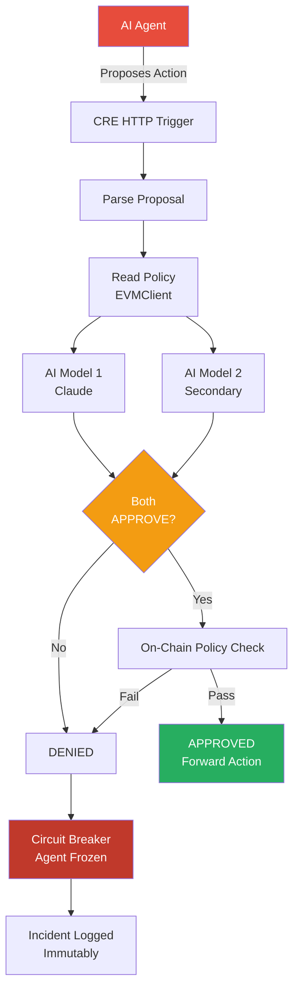

# SentinelCRE

**Decentralized AI Guardian Protocol for Web3**

SentinelCRE is an infrastructure-level sentinel guardian that sits between AI agents and on-chain execution, using Chainlink CRE for multi-AI consensus, policy enforcement, and circuit breakers. It proactively prevents bad actors from executing malicious on-chain actions through compromised AI agents.

Built for the [Chainlink Convergence Hackathon](https://chain.link/) (Feb 2026).

**Tracks:** AI + Web3 | Privacy / Confidential Compute

### Deployed Contracts (Tenderly Virtual TestNet — Sepolia Fork)

| Contract | Address |
|----------|---------|
| **SentinelGuardian** | [`0x3e2D7CE3CcB520f26dE6fe499bAA38A28cfd476f`](https://dashboard.tenderly.co/) |
| **AgentRegistry** | [`0xb008CE7EE90C66A219C842E69a4fBAF7E5359bbE`](https://dashboard.tenderly.co/) |

**Demo Transactions (viewable in Tenderly Dashboard):**
- **Approved Trade** — 0.5 ETH swap approved, action stats updated
- **Infinite Mint BLOCKED** — 1B token mint caught by on-chain policy, circuit breaker fired, agent frozen

---

## The Problem

AI agents are increasingly executing real on-chain actions — DeFi swaps, token mints, contract calls. But when agents go rogue through prompt injection, model poisoning, or malicious actors, there's no decentralized safety layer to prevent catastrophic actions.

Real-world examples of what SentinelCRE prevents:
- **Paid Network ($180M)** — Infinite mint exploit drained the entire protocol
- **Cover Protocol** — Attacker minted tokens to crash the price
- **Uranium Finance** — Balance manipulation led to fund drain

## The Solution

SentinelCRE acts as a **decentralized middleware layer** between AI agents and on-chain execution:

```
AI Agent proposes action
    → CRE HTTP Trigger receives proposal
    → Policy pre-check (value limits, whitelists, rate limits, mint caps)
    → Multi-AI consensus (2 models must BOTH approve)
    → On-chain verdict via EVMClient
        → APPROVED: action forwarded to target contract
        → DENIED: circuit breaker fires, agent frozen, incident logged
```

### Two-Layer Defense

1. **AI Consensus Layer** — Two independent AI models evaluate every proposed action. Both must agree the action is safe. If either model flags it, the action is denied.

2. **On-Chain Policy Layer** — Smart contract enforces hard-coded guardrails that no AI can override: transaction value limits, approved contract whitelists, function signature blocklists, rate limiting, and mint caps.

## Architecture



## Demo Scenarios

### 1. Rogue DeFi Trading Agent
A compromised trading agent attempts:
- **100 ETH swap** (limit: 1 ETH) → BLOCKED
- **Call to unapproved contract** → BLOCKED
- **50 rapid-fire transactions** → BLOCKED by on-chain rate limit
- **Blocked function signature** → BLOCKED

### 2. Infinite Stablecoin Mint Attack
A hijacked minting agent attempts to mint **1 billion stablecoins** (cap: 1M tokens):
- AI models flag anomalous mint volume → DENIED
- On-chain policy catches value exceeding mint cap → Circuit breaker fires
- Agent frozen before a single token is minted

## Chainlink Services Used

| Service | Usage | Status |
|---------|-------|--------|
| **CRE Workflow** | Orchestration backbone — HTTP trigger, multi-AI consensus, on-chain writes | Real |
| **CRE HTTPClient** | Calls 2 AI models with `ConsensusAggregationByFields` (identical verdict consensus) | Real |
| **CRE EVMClient** | Reads agent policies, writes verdicts to SentinelGuardian contract | Real |
| **CRE CronCapability** | Periodic health checks — auto-freeze anomalous agents | Real |
| **Confidential HTTP** | Hides API keys and guardrail thresholds from DON nodes | Real (SDK alpha) |
| **Confidential Compute** | Hide policy parameters from AI agents (prevent gaming) | Boundary markers |

### Why CRE?

CRE provides exactly what SentinelCRE needs:
- **BFT Consensus** — Multiple DON nodes must agree on AI verdicts (no single point of failure)
- **HTTPClient** — Native multi-endpoint consensus for calling 2+ AI models
- **EVMClient** — Read policies and write verdicts without external infrastructure
- **Confidential HTTP** — Hide guardrail thresholds so AI agents can't learn their own limits

## Smart Contracts

### SentinelGuardian.sol
Core guardian with AccessControl + Pausable. Receives CRE verdicts, enforces policy, triggers circuit breakers.

**Policy struct** includes: `maxTransactionValue`, `maxDailyVolume`, `maxMintAmount`, `rateLimit`, `rateLimitWindow`, `approvedContracts[]`, `blockedFunctions[]`

### AgentRegistry.sol
Simple registry mapping agent IDs to metadata (name, description, owner).

### Test Coverage
**61 tests across 3 test suites**, all passing:
- `SentinelGuardian.t.sol` — 45 tests (registration, verdicts, policy enforcement, circuit breaker, freeze/unfreeze/revoke, rate limits, infinite mint)
- `AgentRegistry.t.sol` — 8 tests
- `Integration.t.sol` — 8 tests (full lifecycle including infinite mint blocked)

## Tech Stack

- **CRE SDK** — @chainlink/cre-sdk v1.0.9 (TypeScript)
- **Solidity** — 0.8.24 via Foundry
- **OpenZeppelin** — v5.5.0 (AccessControl, Pausable)
- **forge-std** — v1.14.0
- **Runtime** — Bun
- **Contract interaction** — viem
- **Config validation** — Zod

## Quick Start

### Prerequisites
- [Foundry](https://book.getfoundry.sh/getting-started/installation)
- [Bun](https://bun.sh/)

### Install
```bash
cd SentinelCRE
bun install
```

### Build & Test Contracts
```bash
cd contracts
forge build
forge test -v
```

### Run Demo
```bash
# Terminal 1: Start mock AI evaluation server
bun run mock-api

# Terminal 2: Run normal agent (all actions approved)
bun run demo:normal

# Terminal 3: Run rogue agent (attacks blocked)
bun run demo:rogue
```

### Deploy
```bash
# Set environment variables
export DEPLOYER_PRIVATE_KEY=0x...
export RPC_URL=https://...

# Deploy via Foundry
cd contracts
forge script script/Deploy.s.sol --rpc-url $RPC_URL --broadcast

# Or deploy via TypeScript
bun run deploy:contracts
```

## Project Structure

```
SentinelCRE/
├── contracts/                    # Foundry root
│   ├── src/
│   │   ├── SentinelGuardian.sol  # Core guardian (policy + circuit breaker)
│   │   ├── AgentRegistry.sol     # Agent registration
│   │   ├── interfaces/           # ISentinelGuardian
│   │   └── libraries/            # PolicyLib (validation logic)
│   ├── test/                     # 61 Foundry tests
│   └── script/                   # Deploy.s.sol
├── sentinel-workflow/            # CRE TypeScript workflow
│   └── main.ts                   # HTTP + Cron handlers
├── api-server/                   # Mock AI evaluation server
│   └── server.ts
├── agent-simulator/              # Demo agents
│   ├── normal-agent.ts           # Well-behaved agent
│   └── rogue-agent.ts            # 5 attack scenarios
├── config/                       # CRE configs + fixtures
└── docs/                         # Architecture, demo script, security model
```

## Security Model

SentinelCRE uses a **fail-safe** design:
- Any error in the pipeline defaults to **DENY**
- AI models must unanimously approve (both or neither)
- On-chain policy cannot be bypassed by AI consensus
- Circuit breaker is irreversible without admin intervention
- Incident history is immutable and bounded (rolling buffer, max 100)

## Why SentinelCRE Wins

| Differentiator | Details |
|---|---|
| **Real problem, real stakes** | AI agents are executing on-chain today. Infinite mint exploits have drained $180M+ from real protocols. SentinelCRE prevents the next one. |
| **Two-layer defense** | AI consensus + on-chain policy — even if AI models are wrong, hard-coded guardrails catch what they miss. No single point of failure. |
| **Deep CRE integration** | Uses 5 CRE capabilities (HTTPClient, EVMClient, CronCapability, Confidential HTTP, ConsensusAggregation) — not a wrapper, a native CRE application. |
| **Proactive, not reactive** | Unlike kill switches that fire after damage is done, SentinelCRE blocks malicious actions before they execute. |
| **61 tests, 3 suites** | Production-grade test coverage including infinite mint attack, rate limiting, circuit breaker, freeze/unfreeze lifecycle. |
| **Confidential Compute ready** | Boundary markers in place — when CC SDK ships, policy thresholds are hidden from AI agents, preventing them from gaming their own limits. |

## Demo Video

> Video link: *Coming soon*

## Team

**Willis** — @ProjectWaja | Blockchain Musketeers

## License

MIT
