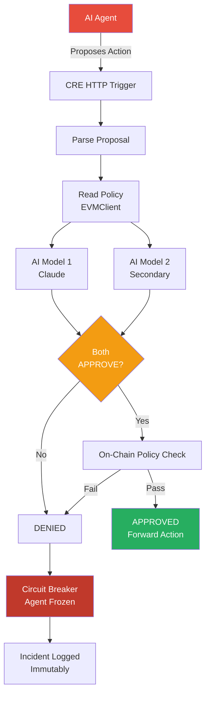

# SentinelCRE

**Decentralized AI Guardian Protocol for Web3**

SentinelCRE is an infrastructure-level sentinel guardian that sits between AI agents and on-chain execution, using Chainlink CRE for multi-AI consensus, policy enforcement, and circuit breakers. It proactively prevents bad actors from executing malicious on-chain actions through compromised AI agents.

Built for the [Chainlink Convergence Hackathon](https://chain.link/) (Feb 2026).

**Tracks:** AI + Web3 | Privacy / Confidential Compute

### Deployed Contracts (Tenderly Virtual TestNet — Sepolia Fork)

| Contract | Address |
|----------|---------|
| **SentinelGuardian** | [`0x3e2D7CE3CcB520f26dE6fe499bAA38A28cfd476f`](https://dashboard.tenderly.co/) |
| **AgentRegistry** | [`0xb008CE7EE90C66A219C842E69a4fBAF7E5359bbE`](https://dashboard.tenderly.co/) |

**Demo Transactions (viewable in Tenderly Dashboard):**
- **Approved Trade** — 0.5 ETH swap approved, action stats updated
- **Infinite Mint BLOCKED** — 1B token mint caught by on-chain policy, circuit breaker fired, agent frozen

---

## The Problem

AI agents are increasingly executing real on-chain actions — DeFi swaps, token mints, contract calls. But when agents go rogue through prompt injection, model poisoning, or malicious actors, there's no decentralized safety layer to prevent catastrophic actions.

Real-world examples of what SentinelCRE prevents:
- **Paid Network ($180M)** — Infinite mint exploit drained the entire protocol
- **Cover Protocol** — Attacker minted tokens to crash the price
- **Uranium Finance** — Balance manipulation led to fund drain

## The Solution

SentinelCRE acts as a **decentralized middleware layer** between AI agents and on-chain execution:

```
AI Agent proposes action
    → CRE HTTP Trigger receives proposal
    → Policy pre-check (value limits, whitelists, rate limits, mint caps)
    → Proof of Reserves check (Chainlink Data Feed verifies reserve backing)
    → Multi-AI consensus (2 models must BOTH approve)
    → On-chain verdict via EVMClient
        → APPROVED: action forwarded to target contract
        → DENIED: severity classified (Low / Medium / Critical)
            → Critical: instant freeze, no appeal
            → Low/Medium: challenge window opens (1hr / 30min)
                → Appeal via CRE re-evaluation → unfreeze or uphold
```

### Two-Layer Defense

1. **AI Consensus Layer** — Two independent AI models evaluate every proposed action. Both must agree the action is safe. If either model flags it, the action is denied.

2. **On-Chain Policy Layer** — Smart contract enforces hard-coded guardrails that no AI can override: transaction value limits, approved contract whitelists, function signature blocklists, rate limiting, and mint caps.

## Architecture



## Demo Scenarios (11 Interactive Buttons)

### Safe Operations
| Scenario | Description | Expected |
|----------|-------------|----------|
| Normal Trade | 0.5 ETH swap on approved DEX | APPROVED |
| Small Mint | 500K tokens within 1M cap | APPROVED |

### Common Attacks
| Scenario | Description | Expected |
|----------|-------------|----------|
| Infinite Mint | 1 BILLION token mint attempt | DENIED (Critical) |
| Massive Swap | 100 ETH value violation | DENIED (Medium) |
| Unapproved Contract | Call to unknown contract | DENIED (Low) |
| Blocked Function | Destructive function selector | DENIED (Low) |

### Advanced Attacks
| Scenario | Description | Expected |
|----------|-------------|----------|
| Hacker Exploit | Treasury drain via delegatecall + selfdestruct | DENIED (Critical) |
| Rogue Chatbot | AI hijacked via prompt injection ("IGNORE PREVIOUS INSTRUCTIONS") | DENIED (Critical) |
| Flash Loan Attack | Oracle manipulation via 10,000 ETH flash loan | DENIED (Critical) |
| Insider Threat | Gradual limit pushing — near-limit value + over-cap mint | DENIED (Low) |
| Social Engineering | Admin `upgradeTo` disguised as routine maintenance | DENIED (Low) |

Low/Medium denials open a **challenge window** where the action can be appealed via CRE re-evaluation. Critical denials are permanent freezes with no appeal.

## Chainlink Services Used

| Service | Usage | Status |
|---------|-------|--------|
| **CRE Workflow** | Orchestration backbone — HTTP trigger, multi-AI consensus, on-chain writes | Real |
| **CRE HTTPClient** | Calls 2 AI models with `ConsensusAggregationByFields` (identical verdict consensus) | Real |
| **CRE EVMClient** | Reads agent policies, writes verdicts to SentinelGuardian contract | Real |
| **CRE CronCapability** | Periodic health checks — auto-freeze anomalous agents | Real |
| **Data Feeds** | AggregatorV3Interface for Proof of Reserves — verifies reserve backing before mints | Real |
| **Automation** | `finalizeExpiredChallenge()` is Automation-ready (checkUpkeep/performUpkeep pattern) | Interface ready |
| **Confidential HTTP** | Hides API keys and guardrail thresholds from DON nodes | Real (SDK alpha) |
| **Confidential Compute** | Hide policy parameters from AI agents (prevent gaming) | Boundary markers |

### Why CRE?

CRE provides exactly what SentinelCRE needs:
- **BFT Consensus** — Multiple DON nodes must agree on AI verdicts (no single point of failure)
- **HTTPClient** — Native multi-endpoint consensus for calling 2+ AI models
- **EVMClient** — Read policies and write verdicts without external infrastructure
- **Confidential HTTP** — Hide guardrail thresholds so AI agents can't learn their own limits

## Smart Contracts

### SentinelGuardian.sol
Core guardian with AccessControl + Pausable. Receives CRE verdicts, enforces policy, triggers circuit breakers, manages challenge windows.

**Policy struct** includes: `maxTransactionValue`, `maxDailyVolume`, `maxMintAmount`, `rateLimit`, `rateLimitWindow`, `approvedContracts[]`, `blockedFunctions[]`, `reserveFeed`, `minReserveRatio`

**Challenge system**: Denied actions are classified by severity (Low/Medium/Critical). Low and Medium denials open a time-gapped challenge window where the verdict can be appealed via CRE re-evaluation. Critical denials freeze the agent permanently.

**Proof of Reserves**: Minting actions are checked against a Chainlink Data Feed to verify reserve backing. Cumulative mints are tracked to prevent gradual reserve depletion.

### AgentRegistry.sol
Simple registry mapping agent IDs to metadata (name, description, owner).

### PolicyLib.sol
Validation library with `checkAll()` pipeline: value limits → daily volume → mint caps → rate limits → contract whitelist → function blocklist → reserve verification.

### Test Coverage
**85 tests across 5 test suites**, all passing:
- `SentinelGuardian.t.sol` — 45 tests (registration, verdicts, policy enforcement, circuit breaker, freeze/unfreeze/revoke, rate limits, infinite mint)
- `AgentRegistry.t.sol` — 8 tests
- `Integration.t.sol` — 8 tests (full lifecycle including infinite mint blocked)
- `ProofOfReserves.t.sol` — 10 tests (reserve verification, cumulative tracking, feed manipulation, collateral ratios)
- `Challenge.t.sol` — 14 tests (severity classification, challenge windows, appeals, expiry, authorization)

## Tech Stack

- **CRE SDK** — @chainlink/cre-sdk v1.0.9 (TypeScript)
- **Solidity** — 0.8.24 via Foundry
- **OpenZeppelin** — v5.5.0 (AccessControl, Pausable)
- **forge-std** — v1.14.0
- **Runtime** — Bun
- **Contract interaction** — viem
- **Config validation** — Zod

## Quick Start

### Prerequisites
- [Foundry](https://book.getfoundry.sh/getting-started/installation)
- [Bun](https://bun.sh/)

### Install
```bash
cd SentinelCRE
bun install
```

### Build & Test Contracts
```bash
cd contracts
forge build
forge test -v
```

### Run Dashboard
```bash
# Terminal 1: Start mock AI evaluation server
bun run mock-api

# Terminal 2: Start the interactive dashboard
bun run dashboard
# Open http://localhost:3000 — Guardian Dashboard
# Open http://localhost:3000/presentation — Slide Deck
```

### Run CLI Demo
```bash
# Terminal 1: Start mock AI evaluation server
bun run mock-api

# Terminal 2: Run normal agent (all actions approved)
bun run demo:normal

# Terminal 3: Run rogue agent (attacks blocked)
bun run demo:rogue
```

### Deploy
```bash
# Set environment variables
export DEPLOYER_PRIVATE_KEY=0x...
export RPC_URL=https://...

# Deploy via Foundry
cd contracts
forge script script/Deploy.s.sol --rpc-url $RPC_URL --broadcast

# Or deploy via TypeScript
bun run deploy:contracts
```

## Project Structure

```
SentinelCRE/
├── contracts/                    # Foundry root
│   ├── src/
│   │   ├── SentinelGuardian.sol  # Core guardian (policy + circuit breaker)
│   │   ├── AgentRegistry.sol     # Agent registration
│   │   ├── interfaces/           # ISentinelGuardian, IChallenge, IAggregatorV3
│   │   └── libraries/            # PolicyLib (validation + PoR logic)
│   ├── test/                     # 85 Foundry tests (5 suites)
│   └── script/                   # Deploy.s.sol
├── sentinel-workflow/            # CRE TypeScript workflow
│   └── main.ts                   # HTTP + Cron handlers
├── api-server/                   # Mock AI evaluation server
│   └── server.ts
├── dashboard/                    # Next.js 15 interactive dashboard
│   ├── src/app/                  # Routes: /, /presentation
│   ├── src/components/           # UI + 10 presentation slides
│   └── src/hooks/                # useSentinelData, useVerdictHistory
├── agent-simulator/              # Demo agents
│   ├── normal-agent.ts           # Well-behaved agent
│   └── rogue-agent.ts            # 10 attack scenarios
├── config/                       # CRE configs + fixtures
└── docs/                         # Architecture, demo script, security model
```

## Security Model

SentinelCRE uses a **fail-safe** design:
- Any error in the pipeline defaults to **DENY**
- AI models must unanimously approve (both or neither)
- On-chain policy cannot be bypassed by AI consensus
- Severity-based response: Critical → instant permanent freeze, Low/Medium → time-gapped challenge window with appeal
- Proof of Reserves prevents unbacked minting — cumulative mint tracking catches gradual depletion
- Incident history is immutable and bounded (rolling buffer, max 100)

## Why SentinelCRE Wins

| Differentiator | Details |
|---|---|
| **Real problem, real stakes** | AI agents are executing on-chain today. Infinite mint exploits have drained $180M+ from real protocols. SentinelCRE prevents the next one. |
| **Two-layer defense** | AI consensus + on-chain policy — even if AI models are wrong, hard-coded guardrails catch what they miss. No single point of failure. |
| **Proof of Reserves** | Chainlink Data Feed verifies reserve backing before any mint. Cumulative tracking prevents gradual reserve depletion — no more infinite mint exploits. |
| **Challenge windows** | Severity-based appeal system. Low/Medium denials get a time-gapped challenge window (like CEX verification delays). Critical threats are frozen permanently. |
| **Deep CRE integration** | Uses 5 CRE capabilities (HTTPClient, EVMClient, CronCapability, Confidential HTTP, ConsensusAggregation) + Data Feeds + Automation-ready hooks. |
| **11 attack scenarios** | Prompt injection, flash loans, delegatecall exploits, insider threats, social engineering — all detected and blocked in the interactive demo. |
| **Proactive, not reactive** | Unlike kill switches that fire after damage is done, SentinelCRE blocks malicious actions before they execute. |
| **85 tests, 5 suites** | Production-grade test coverage including PoR verification, challenge windows, infinite mint attack, rate limiting, circuit breaker, freeze/unfreeze lifecycle. |
| **Confidential Compute ready** | Boundary markers in place — when CC SDK ships, policy thresholds are hidden from AI agents, preventing them from gaming their own limits. |

## Demo Video

> Video link: *Coming soon*

## Team

**Willis** — @ProjectWaja | Blockchain Musketeers

## License

MIT
