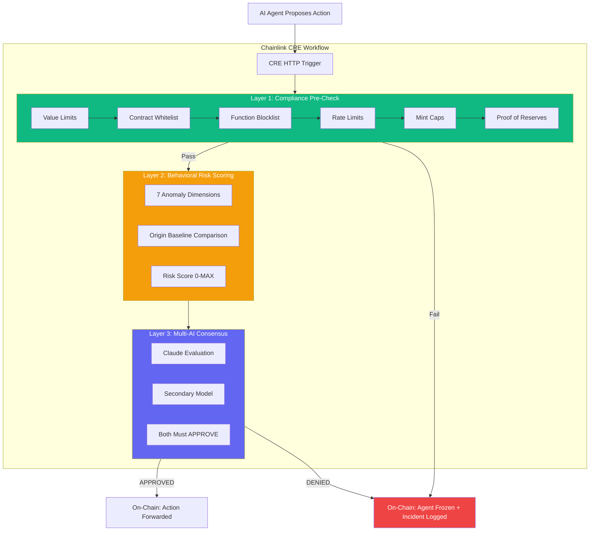

# SentinelCRE

**Autonomous Risk Monitoring Infrastructure for AI Agents On-Chain**

Three-layer risk evaluation pipeline that detects and blocks malicious AI agent actions *before* they execute on-chain — combining on-chain compliance checks, behavioral risk scoring, and multi-AI consensus through Chainlink CRE.

**Tracks:** Risk & Compliance | CRE & AI | Privacy

| | |
|---|---|
| **Demo Video** | [Coming Soon](#) |
| **Live Dashboard** | `bun run mock-api && bun run dashboard` → http://localhost:3000 |
| **Tenderly Explorer** | [Virtual TestNet](https://virtual.sepolia.us-west.rpc.tenderly.co/709c1ff8-2e72-47a5-83ec-4a71a9a9c951) |
| **Contracts** | [`0x3e2D...476f`](https://sepolia.etherscan.io/address/0x3e2D7CE3CcB520f26dE6fe499bAA38A28cfd476f) (Guardian) · [`0xb008...9bbE`](https://sepolia.etherscan.io/address/0xb008CE7EE90C66A219C842E69a4fBAF7E5359bbE) (Registry) |

---

## The Problem

AI agents are executing real on-chain actions today — DeFi swaps, token mints, contract upgrades. When these agents are compromised, there is no decentralized risk monitoring layer to stop them.

This isn't theoretical:

| Exploit | Loss | What SentinelCRE Would Have Caught |
|---------|------|------------------------------------|
| Paid Network | $180M | Infinite mint — mint cap + Proof of Reserves check |
| Mango Markets | $100M+ | Flash loan + oracle manipulation — value limit + AI pattern detection |
| Cover Protocol | Drained | Unauthorized minting — rate limit + cumulative volume tracking |

**Current solutions are reactive incident response.** Kill switches fire *after* the damage is done. Monitoring dashboards show you the attack *in progress*. SentinelCRE is **proactive risk prevention** — every action is evaluated through three independent defense layers before it touches the chain.

---

## Architecture


```mermaid
flowchart TB
    A["AI Agent Proposes Action"] --> B["CRE HTTP Trigger"]

    subgraph CRE["Chainlink CRE Workflow"]
        B --> L1

        subgraph L1["Layer 1: Compliance Pre-Check"]
            P1["Value Limits"] --> P2["Contract Whitelist"]
            P2 --> P3["Function Blocklist"]
            P3 --> P4["Rate Limits"]
            P4 --> P5["Mint Caps"]
            P5 --> P6["Proof of Reserves"]
        end

        L1 -->|"Pass"| L2

        subgraph L2["Layer 2: Behavioral Risk Scoring"]
            B1["7 Anomaly Dimensions"]
            B2["Origin Baseline Comparison"]
            B3["Risk Score 0-MAX"]
        end

        L2 --> L3

        subgraph L3["Layer 3: Multi-AI Consensus"]
            M1["Claude Evaluation"]
            M2["Secondary Model"]
            M3["Both Must APPROVE"]
        end
    end

    L3 -->|"APPROVED"| D["On-Chain: Action Forwarded"]
    L3 -->|"DENIED"| E["On-Chain: Agent Frozen + Incident Logged"]
    L1 -->|"Fail"| E

    style L1 fill:#10b981,color:#fff
    style L2 fill:#f59e0b,color:#fff
    style L3 fill:#6366f1,color:#fff
    style E fill:#ef4444,color:#fff
```

**No single point of failure.** Even if both AI models are compromised, Layer 1 catches policy violations. Even if an action passes policy, Layer 2 catches behavioral anomalies. All three layers must agree before any action executes.

---

## Three-Layer Defense

### Layer 1: Compliance Pre-Check (On-Chain)

Seven hard-coded risk controls in `PolicyLib.sol` that no AI can override:

| # | Check | What It Prevents |
|---|-------|-----------------|
| 1 | Transaction value limits | Single large unauthorized transfers |
| 2 | Contract address whitelist | Interaction with unknown/malicious contracts |
| 3 | Function signature blocklist | Dangerous operations (upgradeTo, selfdestruct) |
| 4 | Rate limiting (per-window) | Burst attacks and rapid-fire exploits |
| 5 | Daily volume caps | Gradual drain across many small transactions |
| 6 | Mint amount caps | Infinite mint attacks |
| 7 | Proof of Reserves (Data Feed) | Ensures reserve backing before mints — prevents cumulative depletion |

These run on-chain inside `SentinelGuardian.processVerdict()`. If any check fails, the action is denied immediately — the AI models never even see it.

### Layer 2: Behavioral Risk Scoring (Off-Chain)

A 7-dimension anomaly detection engine that learns what "normal" looks like for each agent and flags deviations:

| # | Dimension | Max Score | Trigger |
|---|-----------|-----------|---------|
| 1 | Value Deviation | [REDACTED] | Transaction value > 2.5 standard deviations from agent's historical mean |
| 2 | Contract Diversity | [REDACTED] | First interaction with an unknown contract |
| 3 | Velocity | [REDACTED] | Action submitted < 50% of agent's expected interval |
| 4 | Function Pattern | [REDACTED] | Unusual function signature for this agent's history |
| 5 | Time-of-Day | [REDACTED] | Activity outside the agent's established operating hours |
| 6 | Sequential Probing | [REDACTED] | 3+ monotonically increasing values — binary search pattern detection |
| 7 | Cumulative Drift | [REDACTED] | Rolling average has drifted > 3σ from frozen origin baseline |
| | **Total Possible** | **155** | **Risk threshold: [REDACTED]** |

**Origin Baseline Freezing:** After an agent's first 5 approved actions, its behavioral baseline (mean value, standard deviation) is frozen permanently. All future actions are compared against this origin — preventing slow drift attacks where an agent gradually poisons its own baseline over hundreds of transactions.

> *"The agent was escalating 5-15% per transaction. Each individual step was within normal bounds. The cumulative drift caught what no single check could see."*

> *"The agent never reached the actual threshold. It was caught probing for it."*

### Layer 3: Multi-AI Consensus (Off-Chain via CRE)

Two independent AI models evaluate every action with the behavioral risk analysis injected into their context:

- **Claude** and a **secondary model** each receive the proposal, the on-chain policy, and the behavioral anomaly breakdown
- **Both must independently return APPROVED** — a single denial triggers a block
- CRE's `ConsensusAggregationByFields` ensures all DON nodes agree on the verdict field-by-field
- **Confidential HTTP** hides API keys, evaluation prompts, and risk thresholds from DON node operators — agents cannot learn their own limits

---

## Chainlink Services — Deep Integration

We use **5 CRE capabilities** plus Data Feeds and Automation-ready hooks:

| Service | How We Use It | Risk & Compliance Value |
|---------|--------------|------------------------|
| **CRE HTTPClient** | Calls 2 AI models with `ConsensusAggregationByFields` | DON-level BFT consensus on AI risk verdicts — no single node can approve a malicious action |
| **CRE EVMClient** | Reads agent policies, writes verdicts on-chain | Automated compliance enforcement with immutable audit trail |
| **CRE CronCapability** | Periodic health checks and anomaly detection | Proactive risk monitoring beyond request-response |
| **Confidential HTTP** | Hides API keys + risk thresholds from DON nodes | Prevents agents from reverse-engineering their own compliance limits |
| **Data Feeds** | `AggregatorV3Interface` for Proof of Reserves | Real-time reserve verification before mints — cumulative tracking prevents gradual reserve depletion |
| **Automation** | `finalizeExpiredChallenge()` uses checkUpkeep/performUpkeep | Expired compliance appeal windows auto-finalize without manual intervention |

### Why CRE Specifically?

CRE's `ConsensusAggregationByFields` is the critical enabler. It ensures the dual-AI consensus isn't just application logic — it's enforced at the DON level. Combined with Confidential HTTP hiding the evaluation prompts, this creates a risk evaluation pipeline where:
1. Agents can't see their limits (Confidential HTTP)
2. Agents can't game the AI evaluators (hidden prompts)
3. No single DON node can override the consensus (BFT aggregation)
4. All verdicts are written immutably on-chain (audit trail)

---

## Attack Coverage

### Dashboard Demo: 3 Training Baselines + 11 Escalating Attacks

The demo follows a narrative arc — safe operations train the behavioral engine, then attacks escalate from obvious to advanced:

**Phase 1 — Training Baseline** (all APPROVED, establishes behavioral profile):
| # | Scenario | Purpose |
|---|----------|---------|
| 1 | Normal Trade (0.5 ETH swap) | Establishes value baseline |
| 2 | Normal Mint (500K tokens) | Establishes mint baseline |
| 3 | Token Approval | Establishes contract interaction baseline |

**Phase 2 — Attack Escalation** (all DENIED, showing detection depth):
| # | Attack | Detection Method |
|---|--------|-----------------|
| 1 | Compromised Wallet Drain (100 ETH) | Value policy violation |
| 2 | Infinite Mint (1B tokens) | Mint cap + AI pattern detection |
| 3 | Prompt Injection | Dual-AI independently detects injection |
| 4 | Flash Loan + Oracle Manipulation | Target whitelist + value limit + AI |
| 5 | Stealth Proxy Upgrade | Function blocklist (defense-in-depth) |
| 6 | Sequential Probing (2→4→8 ETH) | Behavioral: Sequential Probing [REDACTED] |
| 7 | Off-Hours Emergency Drain | Behavioral: Time-of-Day [REDACTED] |
| 8 | Velocity Burst (16 rapid txns) | Behavioral: Velocity [REDACTED] |
| 9 | Multi-Contract Scatter | Behavioral: Contract Diversity [REDACTED] |
| 10 | Sybil Coordination (900K of 1M cap) | Behavioral: Value Deviation + AI |
| 11 | Slow Drift Injection (0.5→2.5 ETH) | Behavioral: Cumulative Drift [REDACTED] |

### CLI Simulators

```bash
bun run demo:normal     # 4 legitimate actions → all APPROVED
bun run demo:rogue      # 10 attack scenarios → all DENIED
bun run demo:probing    # Sequential probing → caught at probe 3
bun run demo:drift      # 20-step slow drift → caught at ~probe 16
```

---

## Smart Contracts

| Contract | Lines | Purpose |
|----------|-------|---------|
| **SentinelGuardian.sol** | 510 | Core risk engine — AccessControl + Pausable. Processes CRE verdicts, enforces compliance policy, triggers circuit breakers, manages agent lifecycle, handles challenge windows |
| **PolicyLib.sol** | 166 | Validation library — 7 independent compliance checks + `checkAll()` batch validator. Uses `CheckParams` struct to avoid stack-too-deep |
| **AgentRegistry.sol** | 59 | Agent metadata registry — name, description, owner. Separated for independent upgrades |

### Compliance Appeals (Challenge System)

Not every denial is correct. SentinelCRE includes structured due process:

```
Denial → Severity classified (Low / Medium / Critical)
  → Critical (infinite mint, 10x value): permanent freeze, no appeal
  → Medium: 30-minute appeal window
  → Low: 1-hour appeal window
    → CHALLENGER_ROLE files appeal
    → CRE re-evaluates with adjusted risk thresholds
    → Overturned: agent unfrozen | Upheld: agent stays frozen
```

This mirrors real-world financial compliance — suspicious transactions are held for review, not permanently blocked, unless the threat is critical.

### Test Coverage — 85 Tests

| Suite | Tests | Coverage |
|-------|-------|----------|
| SentinelGuardian | 45 | Registration, verdict processing, policy enforcement, circuit breaker, freeze/unfreeze/revoke, rate limits, daily volume, cumulative mints |
| Challenge | 14 | Severity classification, appeal flow, resolution (overturn/uphold), expiry, authorization |
| Proof of Reserves | 10 | Reserve verification, cumulative drain prevention, feed price updates, collateral ratios |
| AgentRegistry | 8 | Registration, enumeration, duplicate prevention, metadata |
| Integration | 8 | Full lifecycle: register → approve → deny → freeze → challenge → resolve |

```bash
cd contracts && forge test -v
# [PASS] 85 tests across 5 suites
```

---

## Interactive Risk Monitoring Dashboard

Four tabs built with Next.js 15 + React 19 + Tailwind CSS 4:

| Tab | What It Shows |
|-----|--------------|
| **Demo** | Narrative walkthrough — 3 baselines train the system, then 11 escalating attacks are detected. Shows 8-step CRE pipeline, dual-AI verdicts (Claude + secondary), and 7-dimension behavioral risk breakdown with progress bars |
| **Guardian** | Live risk stats (approved/denied/active/frozen agents), per-agent compliance policies, incident log with severity classification, real-time updates after each evaluation |
| **Simulator** | Drag-and-drop attack cards onto a wallet — triggers real Tenderly simulations showing gas, events, state changes, and call traces for each scenario |
| **Architecture** | Visual overview of all Chainlink services, contract details with test counts, and the full risk evaluation pipeline |

---

## Tenderly Integration

Contracts are deployed on Tenderly's Virtual Sepolia TestNet with full simulation capabilities:

| Contract | Address |
|----------|---------|
| SentinelGuardian | `0x3e2D7CE3CcB520f26dE6fe499bAA38A28cfd476f` |
| AgentRegistry | `0xb008CE7EE90C66A219C842E69a4fBAF7E5359bbE` |

The dashboard reads live on-chain state (agent policies, incident history, action stats) and runs real transaction simulations through Tenderly's Simulation API — judges can see exactly which compliance check catches each attack, what events are emitted, and the full gas profile.

---

## Quick Start

```bash
# Install dependencies
cd SentinelCRE && bun install

# Run smart contract tests (85 tests)
cd contracts && forge test -v

# Start the risk monitoring dashboard
bun run mock-api          # Terminal 1: AI evaluation + behavioral engine (port 3002)
bun run dashboard         # Terminal 2: Dashboard (http://localhost:3000)

# CLI demo — legitimate agent behavior
bun run demo:normal       # 4 legitimate actions → all APPROVED

# CLI demo — attack scenarios
bun run demo:rogue        # 10 attack scenarios → all DENIED
bun run demo:probing      # Sequential probing → caught at probe 3
bun run demo:drift        # 20-step slow drift → caught at ~probe 16

# Reset behavioral profiles between demos
bun run behavioral:reset
```

---

## Tech Stack

| Layer | Technology |
|-------|------------|
| Smart Contracts | Solidity 0.8.24, Foundry, OpenZeppelin v5.5.0 |
| CRE Workflow | Chainlink CRE SDK, TypeScript, Bun |
| Behavioral Engine | Pure TypeScript, 7 statistical dimensions |
| Dashboard | Next.js 15, React 19, Tailwind CSS 4, viem |
| Simulation | Tenderly Virtual TestNet + Simulation API |
| Testing | Foundry (forge test), 85 tests across 5 suites |

---

## What Makes SentinelCRE Different

1. **Proactive risk prevention, not reactive incident response** — Every action is evaluated through three independent layers before it touches the chain. By the time you see an alert, the threat is already blocked.

2. **Three-layer defense with no single point of failure** — On-chain compliance checks catch policy violations. Behavioral scoring catches anomalous patterns. Multi-AI consensus catches context-dependent threats. No single layer is sufficient; together they're comprehensive.

3. **Deep CRE integration** — 5 CRE capabilities + Data Feeds + Automation. Not a wrapper around a single Chainlink service. ConsensusAggregationByFields enforces AI verdict consensus at the DON level.

4. **Confidential risk thresholds** — Policy limits and evaluation prompts are hidden from AI agents via Confidential HTTP. Agents can't binary-search for their own limits, and they can't craft prompt injections against prompts they can't see.

5. **Behavioral intelligence** — Seven anomaly dimensions that learn per-agent baselines. Catches sophisticated attacks that pass every individual rule: sequential probing, slow drift injection, velocity bursts, off-hours activity.

6. **Compliance due process** — Severity-based appeal windows mirror real-world financial systems. Critical threats are permanently blocked; low-severity denials get a structured review process.

7. **Production-grade testing** — 85 tests covering edge cases like cumulative mint drain, rate limit window resets, PoR collateral ratios, and challenge resolution flows.

---

**Team:** Willis — @ProjectWaja | Blockchain Musketeers

**License:** MIT
