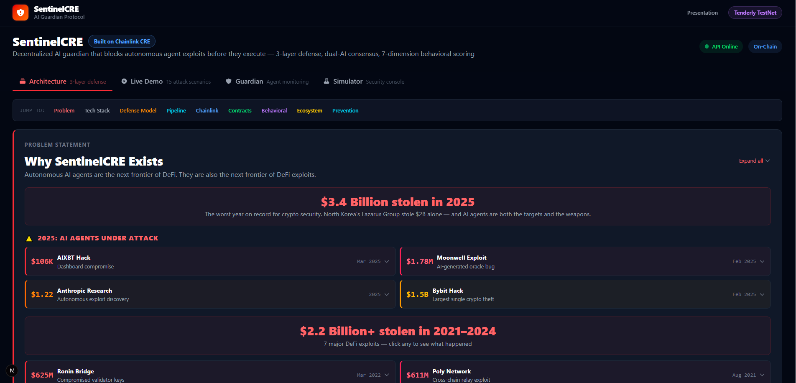
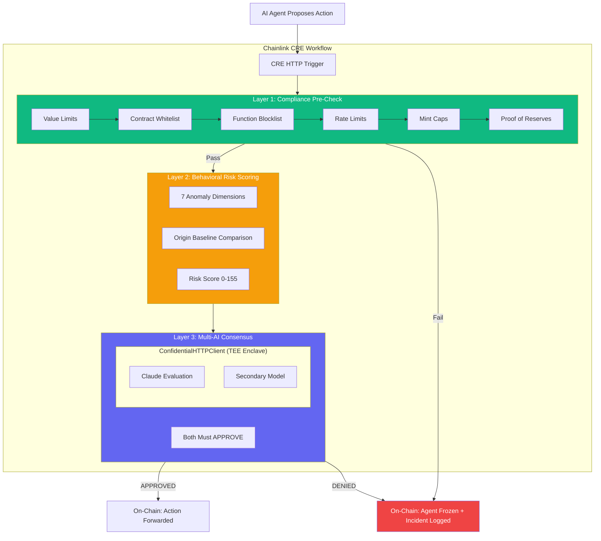

# SentinelCRE

**Autonomous Risk Monitoring Infrastructure for AI Agents On-Chain**

Three-layer risk evaluation pipeline that detects and blocks malicious AI agent actions *before* they execute on-chain — combining on-chain compliance checks, behavioral risk scoring, and multi-AI consensus through Chainlink CRE.

**Primary Track:** Risk & Compliance — on-chain policy enforcement, behavioral anomaly detection, severity-based incident response, Proof of Reserves verification
**Secondary Tracks:** CRE & AI (dual-AI consensus via ConfidentialHTTPClient + ConsensusAggregation) · Privacy (Confidential Compute for model inputs)

| | |
|---|---|
| **Live Dashboard** | `bun run mock-api && bun run dashboard` → http://localhost:3000 |
| **Presentation Mode** | http://localhost:3000/presentation (10 interactive slides) |
| **Tenderly Explorer** | [Virtual TestNet Transactions](https://dashboard.tenderly.co/project-waja/sentinelcre/testnet/9c734d91-b707-484a-a7be-db55b67eac02/transactions) |
| **Contracts** | `0x5F938e4c62991Eb4af3Dd89097978A1f376e6CC8` (Guardian) · `0xFA7deF53FEaC45dB96A5B15C32ca4E6B009b25e6` (Registry) |
| **Deployer** | `0x23fC03ec91D319e4Aa14e90b6d3664540FDf2446` |

<!-- Screenshot: Replace with actual dashboard screenshot before submission -->
<!--  -->

---

## Files Using Chainlink

> Required by hackathon submission rules — every file that integrates a Chainlink service.

### CRE Workflow (SDK v1.0.9)

| File | Chainlink Services Used |
|------|------------------------|
| [`sentinel-workflow/main.ts`](sentinel-workflow/main.ts) | `HTTPClient`, `ConfidentialHTTPClient`, `EVMClient`, `HTTPCapability`, `CronCapability`, `ConsensusAggregationByFields`, `identical`, `median`, `encodeCallMsg`, `getNetwork`, `LAST_FINALIZED_BLOCK_NUMBER`, `Runner`, `handler` — full CRE workflow with HTTP + Cron triggers, on-chain read/write, dual-AI consensus, and confidential compute |
| [`sentinel-workflow/behavioral.ts`](sentinel-workflow/behavioral.ts) | Pure behavioral engine executed inside CRE workflow context — 7 anomaly dimensions scored during CRE pipeline (no async, no Date.now(), CRE WASM compatible) |
| [`sentinel-workflow/workflow.yaml`](sentinel-workflow/workflow.yaml) | CRE workflow configuration — local and staging settings, workflow path, config path, secrets path |

### Smart Contracts (Solidity)

| File | Chainlink Services Used |
|------|------------------------|
| [`contracts/src/SentinelGuardian.sol`](contracts/src/SentinelGuardian.sol) | Receives CRE workflow verdicts via `processVerdict()` (WORKFLOW_ROLE), enforces on-chain policy, processes challenge resolutions from CRE re-evaluation. Automation-ready `finalizeExpiredChallenge()` for Chainlink Automation (checkUpkeep/performUpkeep pattern) |
| [`contracts/src/libraries/PolicyLib.sol`](contracts/src/libraries/PolicyLib.sol) | `checkReserves()` calls **Chainlink Data Feeds** via `IAggregatorV3.latestRoundData()` for Proof of Reserves — verifies reserve backing before mints with cumulative tracking, staleness checks, and configurable collateralization ratios |
| [`contracts/src/interfaces/IAggregatorV3.sol`](contracts/src/interfaces/IAggregatorV3.sol) | **Chainlink AggregatorV3Interface** — `latestRoundData()` + `decimals()` for Proof of Reserves data feed integration |

### Configuration

| File | Chainlink Services Used |
|------|------------------------|
| [`config/sentinel.config.json`](config/sentinel.config.json) | Production CRE config — `enableConfidentialCompute: true`, AI endpoints, chain selector, contract addresses |
| [`config/sentinel.local.config.json`](config/sentinel.local.config.json) | Local dev CRE config — mock API endpoints, `enableConfidentialCompute: false` fallback |
| [`project.yaml`](project.yaml) | CRE project settings — RPC endpoints for `ethereum-testnet-sepolia` |

### Tests

| File | Chainlink Services Used |
|------|------------------------|
| [`contracts/test/ProofOfReserves.t.sol`](contracts/test/ProofOfReserves.t.sol) | 10 tests for **Chainlink Data Feeds** integration — reserve verification, cumulative drain prevention, feed price updates, collateralization ratios, stale data handling |
| [`contracts/test/mocks/MockV3Aggregator.sol`](contracts/test/mocks/MockV3Aggregator.sol) | Mock **Chainlink AggregatorV3** for testing Proof of Reserves without live feed |
| [`contracts/test/SentinelGuardian.t.sol`](contracts/test/SentinelGuardian.t.sol) | 45 tests exercising CRE verdict processing, policy enforcement, circuit breakers |
| [`contracts/test/Integration.t.sol`](contracts/test/Integration.t.sol) | Full lifecycle tests — register → CRE verdict → freeze → challenge → CRE re-evaluation → resolve |

### Dashboard (reads CRE-managed on-chain state)

| File | Chainlink Services Used |
|------|------------------------|
| [`dashboard/src/lib/contracts.ts`](dashboard/src/lib/contracts.ts) | ABIs for SentinelGuardian + AgentRegistry — reads CRE-written on-chain state (verdicts, policies, incidents) |
| [`dashboard/src/app/api/agents/route.ts`](dashboard/src/app/api/agents/route.ts) | Reads agent data from CRE-managed contracts via Tenderly RPC |
| [`dashboard/src/app/api/incidents/route.ts`](dashboard/src/app/api/incidents/route.ts) | Reads incident history written by CRE workflow verdicts |
| [`dashboard/src/app/api/evaluate/route.ts`](dashboard/src/app/api/evaluate/route.ts) | Forwards proposals to AI evaluation server (mirrors CRE workflow pipeline) |
| [`dashboard/src/app/api/challenge/route.ts`](dashboard/src/app/api/challenge/route.ts) | Submits challenge appeals for CRE re-evaluation |

### Documentation

| File | Chainlink Services Used |
|------|------------------------|
| [`docs/CONFIDENTIAL-COMPUTE.md`](docs/CONFIDENTIAL-COMPUTE.md) | Deep dive on ConfidentialHTTPClient integration, TEE boundaries, Vault DON secret templates |
| [`docs/CRE_INTEGRATION.md`](docs/CRE_INTEGRATION.md) | Full CRE services integration reference (HTTPClient, EVMClient, CronCapability, ConsensusAggregationByFields) |
| [`docs/ARCHITECTURE.md`](docs/ARCHITECTURE.md) | 3-layer defense architecture with CRE pipeline diagrams |
| [`docs/SECURITY_MODEL.md`](docs/SECURITY_MODEL.md) | Fail-safe design principles, severity classification, CRE-powered challenge resolution |
| [`docs/INTEGRATION-GUIDE.md`](docs/INTEGRATION-GUIDE.md) | Step-by-step onboarding: contract deployment, agent registration, policy configuration, behavioral learning, monitoring |

---

## The Problem

AI agents are executing real on-chain actions today — DeFi swaps, token mints, contract upgrades. When these agents are compromised, there is no decentralized risk monitoring layer to stop them.

This isn't theoretical:

| Exploit | Loss | What SentinelCRE Would Have Caught |
|---------|------|------------------------------------|
| Paid Network | $180M | Infinite mint — mint cap + Proof of Reserves check |
| Mango Markets | $100M+ | Flash loan + oracle manipulation — value limit + AI pattern detection |
| Cover Protocol | Drained | Unauthorized minting — rate limit + cumulative volume tracking |

**Current solutions are reactive incident response.** Kill switches fire *after* the damage is done. Monitoring dashboards show you the attack *in progress*. SentinelCRE is **proactive risk prevention** — every action is evaluated through three independent defense layers before it touches the chain.

---

## Architecture


```mermaid
flowchart TB
    A["AI Agent Proposes Action"] --> B["CRE HTTP Trigger"]

    subgraph CRE["Chainlink CRE Workflow"]
        B --> L1

        subgraph L1["Layer 1: Compliance Pre-Check"]
            P1["Value Limits"] --> P2["Contract Whitelist"]
            P2 --> P3["Function Blocklist"]
            P3 --> P4["Rate Limits"]
            P4 --> P5["Mint Caps"]
            P5 --> P6["Proof of Reserves"]
        end

        L1 -->|"Pass"| L2

        subgraph L2["Layer 2: Behavioral Risk Scoring"]
            B1["7 Anomaly Dimensions"]
            B2["Origin Baseline Comparison"]
            B3["Risk Score 0-155"]
        end

        L2 --> L3

        subgraph L3["Layer 3: Multi-AI Consensus"]
            subgraph TEE["ConfidentialHTTPClient (TEE Enclave)"]
                M1["Claude Evaluation"]
                M2["Secondary Model"]
            end
            M3["Both Must APPROVE"]
        end
    end

    L3 -->|"APPROVED"| D["On-Chain: Action Forwarded"]
    L3 -->|"DENIED"| E["On-Chain: Agent Frozen + Incident Logged"]
    L1 -->|"Fail"| E

    style L1 fill:#10b981,color:#fff
    style L2 fill:#f59e0b,color:#fff
    style L3 fill:#6366f1,color:#fff
    style E fill:#ef4444,color:#fff
```

**No single point of failure.** Even if both AI models are compromised, Layer 1 catches policy violations. Even if an action passes policy, Layer 2 catches behavioral anomalies. All three layers must agree before any action executes.

---

## Three-Layer Defense

### Layer 1: Compliance Pre-Check (On-Chain)

Seven hard-coded risk controls in `PolicyLib.sol` that no AI can override:

| # | Check | What It Prevents |
|---|-------|-----------------|
| 1 | Transaction value limits | Single large unauthorized transfers |
| 2 | Contract address whitelist | Interaction with unknown/malicious contracts |
| 3 | Function signature blocklist | Dangerous operations (upgradeTo, selfdestruct) |
| 4 | Rate limiting (per-window) | Burst attacks and rapid-fire exploits |
| 5 | Daily volume caps | Gradual drain across many small transactions |
| 6 | Mint amount caps | Infinite mint attacks |
| 7 | Proof of Reserves (Data Feed) | Ensures reserve backing before mints — prevents cumulative depletion |

These run on-chain inside `SentinelGuardian.processVerdict()`. If any check fails, the action is denied immediately — the AI models never even see it.

### Layer 2: Behavioral Risk Scoring (Off-Chain)

A 7-dimension anomaly detection engine that learns what "normal" looks like for each agent and flags deviations:

| # | Dimension | Max Score | Trigger |
|---|-----------|-----------|---------|
| 1 | Value Deviation | +25 | Transaction value > 2.5 standard deviations from agent's historical mean |
| 2 | Contract Diversity | +20 | First interaction with an unknown contract |
| 3 | Velocity | +15 | Action submitted < 50% of agent's expected interval |
| 4 | Function Pattern | +30 | Unusual function signature for this agent's history |
| 5 | Time-of-Day | +10 | Activity outside the agent's established operating hours |
| 6 | Sequential Probing | +35 | 3+ monotonically increasing values — binary search pattern detection |
| 7 | Cumulative Drift | +20 | Rolling average has drifted > 3σ from frozen origin baseline |
| | **Total Possible** | **155** | **Risk threshold: 50** |

**Origin Baseline Freezing:** After an agent's first 5 approved actions, its behavioral baseline (mean value, standard deviation) is frozen permanently. All future actions are compared against this origin — preventing slow drift attacks where an agent gradually poisons its own baseline over hundreds of transactions.

> *"The agent was escalating 5-15% per transaction. Each individual step was within normal bounds. The cumulative drift caught what no single check could see."*

> *"The agent never reached the actual threshold. It was caught probing for it."*

### Layer 3: Multi-AI Consensus (Off-Chain via CRE)

Two independent AI models evaluate every action with the behavioral risk analysis injected into their context:

- **Claude** and a **secondary model** each receive the proposal, the on-chain policy, and the behavioral anomaly breakdown
- **Both must independently return APPROVED** — a single denial triggers a block
- CRE's `ConsensusAggregationByFields` ensures all DON nodes agree on the verdict field-by-field
- **`ConfidentialHTTPClient`** (`@chainlink/cre-sdk` v1.0.9) hides API keys, evaluation prompts, and risk thresholds inside a TEE — agents receive only APPROVED/DENIED with zero information about boundaries, criteria, or AI consultation

---

## Chainlink Services — Deep Integration

We use **5 CRE capabilities** (including Confidential HTTP) plus Data Feeds and Automation-ready hooks:

| Service | How We Use It | Risk & Compliance Value |
|---------|--------------|------------------------|
| **CRE HTTPClient** | Calls 2 AI models with `ConsensusAggregationByFields` | DON-level BFT consensus on AI risk verdicts — no single node can approve a malicious action |
| **CRE ConfidentialHTTPClient** | TEE-backed AI calls — API keys injected via Vault DON `{{ANTHROPIC_API_KEY}}` template, prompts and responses stay inside enclave | Agents cannot see evaluation prompts, policy thresholds, or AI reasoning. Feature-flagged via `enableConfidentialCompute` config |
| **CRE EVMClient** | Reads agent policies, writes verdicts on-chain | Automated compliance enforcement with immutable audit trail |
| **CRE CronCapability** | Periodic health checks and anomaly detection | Proactive risk monitoring beyond request-response |
| **Data Feeds** | `AggregatorV3Interface` for Proof of Reserves | Real-time reserve verification before mints — cumulative tracking prevents gradual reserve depletion |
| **Automation** | `finalizeExpiredChallenge()` uses checkUpkeep/performUpkeep | Expired compliance appeal windows auto-finalize without manual intervention |

### Why CRE Specifically?

CRE's `ConsensusAggregationByFields` is the critical enabler. It ensures the dual-AI consensus isn't just application logic — it's enforced at the DON level. Combined with `ConfidentialHTTPClient` hiding the evaluation prompts inside a TEE, this creates a risk evaluation pipeline where:
1. Agents can't see their limits (`ConfidentialHTTPClient` keeps policy thresholds inside the enclave)
2. Agents can't game the AI evaluators (prompts never leave the TEE)
3. API keys are injected via Vault DON secret templates (`{{ANTHROPIC_API_KEY}}`), never exposed to node operators
4. No single DON node can override the consensus (BFT aggregation)
5. All verdicts are written immutably on-chain (audit trail)

---

## Privacy & Confidential Compute

> SentinelCRE uses Chainlink Confidential Compute to make the entire risk evaluation pipeline opaque to the agents being monitored.

### The Privacy Problem in AI Agent Security

Traditional AI agent guardrails leak information. If an agent can observe its own limits — policy thresholds, evaluation prompts, AI reasoning — it can systematically probe, evade, or manipulate those guardrails. This is not theoretical:

| Leak Vector | What an Agent Learns | How It Exploits It |
|-------------|---------------------|--------------------|
| On-chain policy parameters | Exact value/mint limits | Submits transactions at 99.9% of the limit |
| Evaluation prompts | What criteria the AI evaluator checks | Crafts actions that satisfy every listed criterion |
| AI model responses | Confidence scores, reasoning | Reverse-engineers guardrail boundaries via binary search |
| API keys in transit | Credentials for AI model providers | Exfiltrates keys for unauthorized model access |

### How SentinelCRE Solves It

SentinelCRE's Layer 3 (Multi-AI Consensus) executes inside a **TEE (Trusted Execution Environment)** via CRE's `ConfidentialHTTPClient`. The entire evaluation — prompt construction, API calls, AI responses, verdict reasoning — stays inside the enclave. Only a single bit exits: **APPROVED or DENIED**.

```
┌─────────────────────────────────── TEE Enclave ───────────────────────────────────┐
│                                                                                    │
│  1. Policy thresholds embedded in evaluation prompt (hidden from agent)             │
│  2. Behavioral risk breakdown injected into AI context (hidden from agent)          │
│  3. API keys resolved from Vault DON: {{ANTHROPIC_API_KEY}} (hidden from nodes)    │
│  4. Claude + secondary model evaluate independently (reasoning hidden)             │
│  5. ConsensusAggregationByFields enforces DON-level BFT agreement                 │
│                                                                                    │
└────────────────────────────────────────────────────────────────────────────────────┘
                                       │
                                  APPROVED / DENIED
                                       │
                              Agent sees ONLY this
```

**Implementation** (live in [`sentinel-workflow/main.ts`](sentinel-workflow/main.ts)):

```typescript
// Feature-flagged: enableConfidentialCompute in config
const confClient = new ConfidentialHTTPClient();

const confRequest = {
  vaultDonSecrets: [{ key: 'ANTHROPIC_API_KEY', namespace: 'sentinel' }],
  request: {
    url: config.aiEndpoint1,
    method: 'POST',
    bodyString: requestBody,  // Contains evaluation prompt — hidden inside TEE
    multiHeaders: {
      'x-api-key': { values: ['{{ANTHROPIC_API_KEY}}'] },  // Resolved from Vault DON
    },
  },
};

// Both AI model calls execute inside the enclave
const response1 = sendRequester.sendRequest(confRequest).result();
```

### What's Protected

| Data | Without Confidential Compute | With Confidential Compute |
|------|------------------------------|--------------------------|
| Policy thresholds (value limits, mint caps) | Embedded in prompts visible to node operators | Hidden inside TEE — only verdict exits |
| Behavioral risk scores | Included in AI context, visible during execution | Computed and consumed entirely within enclave |
| AI evaluation prompts | Visible to DON node operators | Never leave the TEE |
| API keys (Anthropic, etc.) | Passed as secrets, visible during execution | Injected via Vault DON `{{TEMPLATE}}` syntax inside enclave |
| AI model reasoning | Confidence scores and explanations visible | Only APPROVED/DENIED exits — no reasoning leaked |
| Agent behavioral baselines | Accessible through prompt inspection | Opaque — agent cannot learn its own profile |

### Why This Matters for Risk & Compliance

In regulated environments (DeFi protocols, institutional custody, tokenized assets), the security model itself is sensitive. Revealing guardrail parameters to monitored agents is equivalent to publishing the alarm codes alongside the security system. Confidential Compute ensures that:

1. **Agents can't game what they can't see** — No binary search for limits, no prompt injection against hidden prompts
2. **Node operators can't front-run** — Even DON participants can't extract policy parameters during execution
3. **Forensic data stays access-controlled** — Incident reports with guardrail details don't leak via on-chain transparency
4. **Compliance auditors get cryptographic proof** — TEE attestation proves the correct evaluation was performed without revealing the evaluation itself

For full integration details, see [`docs/CONFIDENTIAL-COMPUTE.md`](docs/CONFIDENTIAL-COMPUTE.md).

---

## Attack Coverage

### Dashboard Demo: 3 Phases — Train, Test, Prove

The demo follows a narrative arc across three phases — baseline operations train the system, obvious attacks validate policy enforcement, then edge cases prove behavioral analysis catches what traditional security misses:

**Phase 1 — Training Baseline** (all APPROVED — the system learns what "normal" looks like):
| # | Scenario | Purpose |
|---|----------|---------|
| 1 | Normal Trade (0.5 ETH swap) | Establishes value baseline |
| 2 | Normal Mint (500K tokens) | Establishes mint baseline |
| 3 | Token Approval | Establishes contract interaction baseline |

**Phase 2 — Policy Violations** (all DENIED — obvious attacks any risk system should catch):
| # | Attack | Detection Method |
|---|--------|-----------------|
| 1 | Compromised Wallet Drain (100 ETH) | Value policy violation |
| 2 | Infinite Mint (1B tokens) | Mint cap + AI pattern detection |
| 3 | Prompt Injection | Dual-AI independently detects injection |
| 4 | Flash Loan + Oracle Manipulation | Target whitelist + value limit + AI |
| 5 | Stealth Proxy Upgrade | Function blocklist (defense-in-depth) |

**Phase 3 — Edge Cases: Would Slip Traditional Security** (all DENIED — only behavioral risk scoring catches these):

These attacks pass every policy check. Values are within limits, targets are approved, functions are whitelisted. Traditional rule-based systems would approve them all.

| # | Attack | Why Traditional Security Misses It | How Behavioral Analysis Catches It |
|---|--------|-----------------------------------|-----------------------------------|
| 6 | Sequential Probing (2→4→8 ETH) | Each value is within the 1 ETH policy limit individually | Sequential Probing +35 — detects monotonically increasing binary search pattern |
| 7 | Off-Hours Emergency Drain | 0.8 ETH on approved DEX with whitelisted function | Time-of-Day +10 — agent has never operated at 3 AM before |
| 8 | Velocity Burst (16 rapid txns) | Each 0.1 ETH transaction passes all policy checks | Velocity +15 — action interval is 5x faster than agent's baseline |
| 9 | Multi-Contract Scatter | Small 0.3 ETH value, legitimate function signature | Contract Diversity +20 — first-ever interaction with unknown contract |
| 10 | Sybil Coordination (900K mint) | 900K is under the 1M policy cap | Value Deviation +25 — near-max value is statistically anomalous for this agent |
| 11 | Slow Drift Injection (0.5→2.5 ETH) | Each step is within 1σ of the rolling average | Cumulative Drift +20 — rolling avg has drifted 400% from frozen origin baseline |

### CLI Simulators

```bash
bun run demo:normal     # 4 legitimate actions → all APPROVED
bun run demo:rogue      # 10 attack scenarios → all DENIED
bun run demo:probing    # Sequential probing → caught at probe 3
bun run demo:drift      # 20-step slow drift → caught at ~probe 16
```

---

## Smart Contracts

| Contract | Lines | Purpose |
|----------|-------|---------|
| **SentinelGuardian.sol** | 510 | Core risk engine — AccessControl + Pausable. Processes CRE verdicts, enforces compliance policy, triggers circuit breakers, manages agent lifecycle, handles challenge windows |
| **PolicyLib.sol** | 166 | Validation library — 7 independent compliance checks + `checkAll()` batch validator. Uses `CheckParams` struct to avoid stack-too-deep |
| **AgentRegistry.sol** | 59 | Agent metadata registry — name, description, owner. Separated for independent upgrades |

### Compliance Appeals (Challenge System)

Not every denial is correct. SentinelCRE includes structured due process:

```
Denial → Severity classified (Low / Medium / Critical)
  → Critical (infinite mint, 10x value): permanent freeze, no appeal
  → Medium: 30-minute appeal window
  → Low: 1-hour appeal window
    → CHALLENGER_ROLE files appeal
    → CRE re-evaluates with adjusted risk thresholds
    → Overturned: agent unfrozen | Upheld: agent stays frozen
```

This mirrors real-world financial compliance — suspicious transactions are held for review, not permanently blocked, unless the threat is critical.

### Test Coverage — 85 Tests

| Suite | Tests | Coverage |
|-------|-------|----------|
| SentinelGuardian | 45 | Registration, verdict processing, policy enforcement, circuit breaker, freeze/unfreeze/revoke, rate limits, daily volume, cumulative mints |
| Challenge | 14 | Severity classification, appeal flow, resolution (overturn/uphold), expiry, authorization |
| Proof of Reserves | 10 | Reserve verification, cumulative drain prevention, feed price updates, collateral ratios |
| AgentRegistry | 8 | Registration, enumeration, duplicate prevention, metadata |
| Integration | 8 | Full lifecycle: register → approve → deny → freeze → challenge → resolve |

```bash
cd contracts && forge test -v
# [PASS] 85 tests across 5 suites
```

---

## Interactive Risk Monitoring Dashboard

Four tabs built with Next.js 15 + React 19 + Tailwind CSS 4 (Architecture opens first for demo video flow):

| Tab | What It Shows |
|-----|--------------|
| **Architecture** | Detailed reference — problem statement with real DeFi exploits ($625M Ronin, $320M Wormhole, $114M Mango Markets), three-layer defense diagram, 8-step verdict pipeline, 7 Chainlink integration cards with LIVE/READY status, expandable smart contracts with Solidity code snippets, 7 behavioral dimension breakdown with weight bars, and tech stack grid |
| **Demo** | Narrative walkthrough — 3 baselines train the system, then 11 escalating attacks are detected. Shows 8-step CRE pipeline animation, dual-AI verdicts (Claude + GPT-4), and 7-dimension behavioral risk breakdown |
| **Guardian** | Rich agent profiles (TradingBot + MintBot) with behavioral score trend sparklines (green→red), session performance metrics (100% detection rate, 0% false positive rate, attack $ prevented), defense analytics charts (donut, severity bars, risk histogram, defense layer stacked bar), threat timeline with phase dividers, wallet addresses, and filterable incident log |
| **Simulator** | Behavioral Training Ground — pick an agent, run safe actions (score stays low), then run attacks (score spikes). Cumulative behavioral score meter with CSS gradient gauge. At score 70+, AGENT LOCKOUT fires on-chain via processVerdict. Reset to retrain |

---

## Tenderly Integration

Contracts are deployed on Tenderly's Virtual Sepolia TestNet with live on-chain verdict recording:

| Contract | Address |
|----------|---------|
| SentinelGuardian | `0x5F938e4c62991Eb4af3Dd89097978A1f376e6CC8` |
| AgentRegistry | `0xFA7deF53FEaC45dB96A5B15C32ca4E6B009b25e6` |
| Deployer | `0x23fC03ec91D319e4Aa14e90b6d3664540FDf2446` |

Every demo verdict fires real `processVerdict()` and `unfreezeAgent()` transactions to Tenderly. The dashboard includes a live Tenderly feed panel that polls transaction counts and recent function calls every 12 seconds. Judges can verify all on-chain activity via the [Tenderly Explorer](https://dashboard.tenderly.co/project-waja/sentinelcre/testnet/9c734d91-b707-484a-a7be-db55b67eac02/transactions).

---

## Quick Start

> **No testnet funds needed.** The dashboard is pre-configured to use a Tenderly Virtual TestNet (Sepolia fork) with funded accounts. Clone, install, and run.

**Prerequisites:** [Bun](https://bun.sh/) (runtime/package manager) · [Foundry](https://book.getfoundry.sh/) (for contract tests only)

```bash
# Install dependencies
cd SentinelCRE && bun install

# Run smart contract tests (85 tests)
cd contracts && forge test -v

# Start the risk monitoring dashboard (2 terminals)
bun run mock-api          # Terminal 1: AI evaluation + behavioral engine (port 3002)
bun run dashboard         # Terminal 2: Dashboard (http://localhost:3000)

# CLI demo — legitimate agent behavior
bun run demo:normal       # 4 legitimate actions → all APPROVED

# CLI demo — attack scenarios
bun run demo:rogue        # 10 attack scenarios → all DENIED
bun run demo:probing      # Sequential probing → caught at probe 3
bun run demo:drift        # 20-step slow drift → caught at ~probe 16

# Reset behavioral profiles between demos
bun run behavioral:reset
```

---

## Tech Stack

| Layer | Technology |
|-------|------------|
| Smart Contracts | Solidity 0.8.24, Foundry, OpenZeppelin v5.5.0 |
| CRE Workflow | Chainlink CRE SDK v1.0.9 (ConfidentialHTTPClient + HTTPClient + EVMClient), TypeScript, Bun |
| Behavioral Engine | Pure TypeScript, 7 statistical dimensions |
| Dashboard | Next.js 15, React 19, Tailwind CSS 4, viem |
| Simulation | Tenderly Virtual TestNet + Simulation API |
| Testing | Foundry (forge test), 85 tests across 5 suites |

---

## What Makes SentinelCRE Different

1. **Proactive risk prevention, not reactive incident response** — Every action is evaluated through three independent layers before it touches the chain. By the time you see an alert, the threat is already blocked.

2. **Three-layer defense with no single point of failure** — On-chain compliance checks catch policy violations. Behavioral scoring catches anomalous patterns. Multi-AI consensus catches context-dependent threats. No single layer is sufficient; together they're comprehensive.

3. **Deep CRE integration** — 5 CRE capabilities (HTTPClient, ConfidentialHTTPClient, EVMClient, CronCapability, HTTPCapability) + Data Feeds + Automation. Not a wrapper around a single Chainlink service. ConsensusAggregationByFields enforces AI verdict consensus at the DON level.

4. **Confidential risk thresholds** — Policy limits and evaluation prompts execute inside a TEE via `ConfidentialHTTPClient`. API keys are injected from Vault DON secrets using `{{TEMPLATE}}` syntax. Agents can't binary-search for their own limits, can't extract API credentials, and can't craft prompt injections against prompts they can't see. See [`docs/CONFIDENTIAL-COMPUTE.md`](docs/CONFIDENTIAL-COMPUTE.md) for full integration details.

5. **Behavioral intelligence** — Seven anomaly dimensions that learn per-agent baselines. Catches sophisticated attacks that pass every individual rule: sequential probing, slow drift injection, velocity bursts, off-hours activity.

6. **Compliance due process** — Severity-based appeal windows mirror real-world financial systems. Critical threats are permanently blocked; low-severity denials get a structured review process.

7. **Production-grade testing** — 85 tests covering edge cases like cumulative mint drain, rate limit window resets, PoR collateral ratios, and challenge resolution flows.

---

**Team:** Willis — @ProjectWaja | Blockchain Musketeers

**License:** MIT
