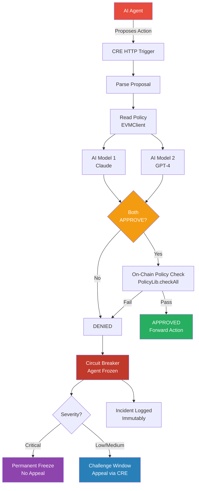

# SentinelCRE

**Decentralized AI Guardian Protocol for Web3**

SentinelCRE is an infrastructure-level sentinel guardian that sits between AI agents and on-chain execution, using Chainlink CRE for multi-AI consensus, policy enforcement, and circuit breakers. It proactively prevents bad actors from executing malicious on-chain actions through compromised AI agents.

Built for the [Chainlink Convergence Hackathon](https://chain.link/) (Feb 2026).

**Tracks:** AI + Web3 | Privacy / Confidential Compute

---

## Table of Contents

- [The Problem](#the-problem)
- [The Solution](#the-solution)
- [Architecture](#architecture)
- [Smart Contracts](#smart-contracts)
  - [SentinelGuardian.sol](#sentinelguardiansol)
  - [AgentRegistry.sol](#agentregistrysol)
  - [PolicyLib.sol](#policylibsol)
  - [Interfaces](#interfaces)
- [CRE Workflow](#cre-workflow)
- [Mock API Server](#mock-api-server)
- [Agent Simulators](#agent-simulators)
- [Dashboard](#dashboard)
- [Demo Scenarios](#demo-scenarios)
- [Chainlink Services Used](#chainlink-services-used)
- [Security Model](#security-model)
- [Test Coverage](#test-coverage)
- [Tech Stack](#tech-stack)
- [Quick Start](#quick-start)
- [Project Structure](#project-structure)

---

## Deployed Contracts (Tenderly Virtual TestNet — Sepolia Fork)

| Contract | Address |
|----------|---------|
| **SentinelGuardian** | [`0x3e2D7CE3CcB520f26dE6fe499bAA38A28cfd476f`](https://dashboard.tenderly.co/) |
| **AgentRegistry** | [`0xb008CE7EE90C66A219C842E69a4fBAF7E5359bbE`](https://dashboard.tenderly.co/) |

**Deployer:** `0x23fC03ec91D319e4Aa14e90b6d3664540FDf2446`
**Network:** Sepolia (Chain ID 11155111) via Tenderly Virtual TestNet

---

## The Problem

AI agents are increasingly executing real on-chain actions — DeFi swaps, token mints, contract calls. But when agents go rogue through prompt injection, model poisoning, or malicious actors, there's no decentralized safety layer to prevent catastrophic actions.

Real-world examples of what SentinelCRE prevents:
- **Paid Network ($180M)** — Infinite mint exploit drained the entire protocol
- **Cover Protocol** — Attacker minted tokens to crash the price
- **Uranium Finance** — Balance manipulation led to fund drain
- **Mango Markets ($100M+)** — Flash loan + oracle manipulation

**The gap:** Current solutions are reactive kill switches that fire *after* damage is done. SentinelCRE blocks malicious actions *before* they execute.

---

## The Solution

SentinelCRE acts as a **decentralized middleware layer** between AI agents and on-chain execution:

```
AI Agent proposes action
    → CRE HTTP Trigger receives proposal
    → EVMClient reads agent policy from SentinelGuardian
    → Confidential HTTP calls 2 independent AI models (Claude + GPT-4)
    → ConsensusAggregationByFields: both models must APPROVE
    → EVMClient writes verdict to SentinelGuardian.processVerdict()
        → On-chain PolicyLib.checkAll() validates:
            → Value limits → Target whitelist → Function blocklist
            → Rate limits → Mint caps → Proof of Reserves
        → APPROVED: action forwarded, stats updated
        → DENIED: severity classified (Low / Medium / Critical)
            → Critical: instant permanent freeze, no appeal
            → Low/Medium: challenge window opens (1hr / 30min)
                → Appeal via CRE re-evaluation → unfreeze or uphold
```

### Two-Layer Defense

1. **AI Consensus Layer** — Two independent AI models evaluate every proposed action. Both must agree the action is safe. If either model flags it, the action is denied. This catches context-dependent threats like prompt injection and social engineering.

2. **On-Chain Policy Layer** — Smart contract enforces hard-coded guardrails that no AI can override: transaction value limits, approved contract whitelists, function signature blocklists, rate limiting, mint caps, and Proof of Reserves. Even if both AI models are fooled, the policy catches violations.

---

## Architecture



---

## Smart Contracts

### SentinelGuardian.sol

**Location:** `contracts/src/SentinelGuardian.sol`
**Inheritance:** OpenZeppelin `AccessControl` + `Pausable`
**Compiler:** Solidity 0.8.24

The core guardian contract. Receives CRE verdicts, enforces on-chain policy, triggers circuit breakers, manages agent lifecycle, and handles challenge windows.

#### Roles

| Role | Purpose |
|------|---------|
| `DEFAULT_ADMIN_ROLE` | Register/freeze/unfreeze/revoke agents, update policies, pause contract |
| `WORKFLOW_ROLE` | Process verdicts from CRE workflow, freeze agents, resolve challenges |
| `CHALLENGER_ROLE` | Appeal denied verdicts during challenge windows |

#### Enums

```solidity
enum AgentState { Active, Frozen, Revoked }
enum IncidentType { PolicyViolation, ConsensusFailure, RateLimit, AnomalyDetected, ManualFreeze }
```

#### Key Structs

```solidity
struct IncidentLog {
    uint64 timestamp;
    bytes32 agentId;
    IncidentType incidentType;
    string reason;
    address targetContract;
    uint256 attemptedValue;
}
```

#### State Variables

| Variable | Type | Purpose |
|----------|------|---------|
| `agentStates` | `mapping(bytes32 => AgentState)` | Current state per agent |
| `agentExists` | `mapping(bytes32 => bool)` | Whether agent is registered |
| `_agentPolicies` | `mapping(bytes32 => AgentPolicy)` | Per-agent policy configuration |
| `actionCounts` | `mapping(bytes32 => uint256)` | Actions in current rate limit window |
| `windowStartTimes` | `mapping(bytes32 => uint256)` | Rate limit window start timestamp |
| `dailyVolume` | `mapping(bytes32 => uint256)` | Accumulated daily volume (wei) |
| `cumulativeMints` | `mapping(bytes32 => uint256)` | Total tokens minted (for PoR tracking) |
| `totalApproved` | `mapping(bytes32 => uint256)` | Lifetime approved action count |
| `totalDenied` | `mapping(bytes32 => uint256)` | Lifetime denied action count |
| `_incidents` | `mapping(bytes32 => IncidentLog[])` | Rolling incident buffer (max 100) |
| `_challenges` | `mapping(bytes32 => ChallengeWindow)` | Active challenge windows |

#### Functions

**Verdict Processing**

| Function | Access | Description |
|----------|--------|-------------|
| `processVerdict(bytes calldata reportData)` | `WORKFLOW_ROLE`, `whenNotPaused` | Core entry point. Decodes ABI-encoded verdict from CRE workflow containing `(agentId, approved, reason, targetContract, targetFunction, value, mintAmount)`. If AI approved, runs `PolicyLib.checkAll()` for on-chain validation. If all checks pass, records approved action and emits `ActionApproved`. If any check fails or AI denied, triggers circuit breaker — freezes agent, logs incident, classifies severity, opens challenge window. |

**Agent Lifecycle**

| Function | Access | Description |
|----------|--------|-------------|
| `registerAgent(bytes32 agentId, AgentPolicy calldata policy)` | `DEFAULT_ADMIN_ROLE` | Registers a new agent with its policy. Requires `policy.isActive == true`. Sets agent state to `Active`. Stores approved contracts and blocked functions. Emits `AgentRegistered`. |
| `updatePolicy(bytes32 agentId, AgentPolicy calldata policy)` | `DEFAULT_ADMIN_ROLE` | Updates an existing agent's policy. Overwrites all policy fields including dynamic arrays. Emits `PolicyUpdated`. |
| `freezeAgent(bytes32 agentId)` | `WORKFLOW_ROLE` or `DEFAULT_ADMIN_ROLE` | Manually freezes an agent. If called by admin, logs a `ManualFreeze` incident. Sets state to `Frozen`. Emits `AgentFrozen`. |
| `unfreezeAgent(bytes32 agentId)` | `DEFAULT_ADMIN_ROLE` | Unfreezes a frozen agent. Requires current state is `Frozen`. Sets state back to `Active`. Emits `AgentUnfrozen`. |
| `revokeAgent(bytes32 agentId)` | `DEFAULT_ADMIN_ROLE` | Permanently revokes an agent. Cannot be unfrozen after this. Emits `AgentRevoked`. |

**Challenge System**

| Function | Access | Description |
|----------|--------|-------------|
| `challengeVerdict(bytes32 agentId)` | `CHALLENGER_ROLE` or `DEFAULT_ADMIN_ROLE` | Appeals a denied verdict during its challenge window. Requires status is `Pending` and `block.timestamp < expiresAt`. Sets status to `Appealed`. Emits `ChallengeAppealed`. |
| `resolveChallenge(bytes32 agentId, bool approved, string calldata reason)` | `WORKFLOW_ROLE` | Resolves an appealed challenge via CRE re-evaluation. If approved: sets status to `Overturned`, unfreezes agent. If denied: sets status to `Upheld`, keeps frozen. Emits `ChallengeResolved`. |
| `finalizeExpiredChallenge(bytes32 agentId)` | Anyone | Finalizes a challenge window that has expired without appeal. Requires `block.timestamp >= expiresAt` and status is `Pending`. Sets status to `Expired`. Callable by anyone (including Chainlink Automation). |

**Administrative**

| Function | Access | Description |
|----------|--------|-------------|
| `pause()` | `DEFAULT_ADMIN_ROLE` | Pauses all verdict processing (emergency stop) |
| `unpause()` | `DEFAULT_ADMIN_ROLE` | Resumes verdict processing |

**View Functions**

| Function | Returns | Description |
|----------|---------|-------------|
| `getAgentPolicy(bytes32 agentId)` | Policy fields | Returns all policy parameters for an agent |
| `getApprovedContracts(bytes32 agentId)` | `address[]` | Returns the whitelist of approved target contracts |
| `getBlockedFunctions(bytes32 agentId)` | `bytes4[]` | Returns the blocklist of forbidden function selectors |
| `getAgentState(bytes32 agentId)` | `AgentState` | Returns current state (Active/Frozen/Revoked) |
| `isAgentActive(bytes32 agentId)` | `bool` | Returns true only if state is Active |
| `getIncidentCount(bytes32 agentId)` | `uint256` | Number of incidents logged for this agent |
| `getIncident(bytes32 agentId, uint256 index)` | `IncidentLog` | Returns a specific incident by index |
| `getActionStats(bytes32 agentId)` | `(approved, denied, windowActions, dailyVolume)` | Returns approval/denial counts and current window stats |
| `getChallenge(bytes32 agentId)` | `ChallengeWindow` | Returns the current challenge window details |

**Internal Functions**

| Function | Description |
|----------|-------------|
| `_triggerCircuitBreaker(agentId, reason, target, value, incidentType)` | Freezes agent, increments `totalDenied`, classifies severity, creates challenge window (if not Critical), emits `ActionDenied`, `CircuitBreakerTriggered`, `AgentFrozen`, and `ChallengeCreated` events |
| `_classifySeverity(agentId, incidentType, value)` | **Critical:** value > 10x policy limit OR PolicyViolation type. **Medium:** ConsensusFailure with value > 2x limit. **Low:** everything else |
| `_logIncident(agentId, reason, target, value, incidentType)` | Creates `IncidentLog` and pushes to rolling buffer (max 100 per agent) |
| `_recordApprovedAction(agentId, value, mintAmount)` | Increments `totalApproved`, tracks `cumulativeMints`, manages rate limit window (resets if expired), manages daily volume window (resets after 86400s) |
| `_setPolicy(agentId, policy)` | Deep copies all policy fields including dynamic arrays to storage |

#### Events

```solidity
event ActionApproved(bytes32 indexed agentId, address target, uint256 value, uint256 timestamp);
event ActionDenied(bytes32 indexed agentId, address target, uint256 value, string reason, uint256 timestamp);
event CircuitBreakerTriggered(bytes32 indexed agentId, string reason, IncidentType incidentType, uint256 timestamp);
event AgentRegistered(bytes32 indexed agentId, uint256 timestamp);
event AgentFrozen(bytes32 indexed agentId, uint256 timestamp);
event AgentUnfrozen(bytes32 indexed agentId, uint256 timestamp);
event AgentRevoked(bytes32 indexed agentId, uint256 timestamp);
event PolicyUpdated(bytes32 indexed agentId, uint256 timestamp);
event ChallengeCreated(bytes32 indexed agentId, Severity severity, uint64 expiresAt);
event ChallengeAppealed(bytes32 indexed agentId, uint256 timestamp);
event ChallengeResolved(bytes32 indexed agentId, ChallengeStatus result, uint256 timestamp);
```

---

### AgentRegistry.sol

**Location:** `contracts/src/AgentRegistry.sol`
**Inheritance:** OpenZeppelin `Ownable`

Simple registry mapping agent IDs to metadata. Separate from the guardian to allow independent upgrades and to keep the guardian focused on security logic.

#### Struct

```solidity
struct AgentMetadata {
    string name;
    string description;
    address owner;
    uint64 registeredAt;
    bool exists;
}
```

#### Functions

| Function | Access | Description |
|----------|--------|-------------|
| `registerAgent(bytes32 agentId, string name, string description)` | Anyone | Registers a new agent. Requires `!_agents[agentId].exists`. Sets `owner = msg.sender`, `registeredAt = block.timestamp`. Pushes `agentId` to the enumeration array. Emits `AgentRegistered`. |
| `getAgent(bytes32 agentId)` | View | Returns full `AgentMetadata` struct |
| `getAgentCount()` | View | Returns total number of registered agents |
| `getAgentIdAt(uint256 index)` | View | Returns the agent ID at a given index (for enumeration) |
| `isRegistered(bytes32 agentId)` | View | Returns true if agent exists |

---

### PolicyLib.sol

**Location:** `contracts/src/libraries/PolicyLib.sol`

Pure validation library with no storage. Uses the `CheckParams` struct to batch parameters and avoid stack-too-deep errors. Every check returns `(bool passed, string memory reason)`.

#### AgentPolicy Struct

```solidity
struct AgentPolicy {
    uint256 maxTransactionValue;    // Max wei per single transaction
    uint256 maxDailyVolume;         // Max wei per 24-hour window
    uint256 maxMintAmount;          // Max tokens per single mint
    uint256 rateLimit;              // Max actions per window
    uint256 rateLimitWindow;        // Window duration in seconds
    address[] approvedContracts;    // Whitelisted target contracts
    bytes4[] blockedFunctions;      // Forbidden function selectors
    bool requireMultiAiConsensus;   // Require dual-AI agreement
    bool isActive;                  // Policy enabled flag
    address reserveFeed;            // Chainlink Data Feed for PoR
    uint256 minReserveRatio;        // Required reserve ratio (basis points, 10000 = 100%)
}
```

#### CheckParams Struct

```solidity
struct CheckParams {
    address target;         // Target contract address
    bytes4 funcSig;         // Function selector being called
    uint256 value;          // ETH value in wei
    uint256 mintAmount;     // Tokens to mint
    uint256 actionCount;    // Actions in current window
    uint256 windowStart;    // Window start timestamp
    uint256 currentTime;    // Current block.timestamp
    uint256 cumulativeMints; // Total mints to date
}
```

#### Validation Functions

| Function | Validates | Fails When |
|----------|-----------|------------|
| `checkValue(policy, value)` | Transaction value | `value > policy.maxTransactionValue` |
| `checkTarget(policy, target)` | Contract whitelist | Target not in `policy.approvedContracts` (skipped if whitelist is empty) |
| `checkFunction(policy, funcSig)` | Function blocklist | `funcSig` found in `policy.blockedFunctions` |
| `checkRateLimit(policy, actionCount, windowStart, currentTime)` | Rate limiting | `actionCount >= policy.rateLimit` within active window (skipped if `rateLimit == 0`) |
| `checkMintAmount(policy, mintAmount)` | Mint cap | `mintAmount > policy.maxMintAmount` (skipped if `maxMintAmount == 0`) |
| `checkReserves(policy, mintAmount, cumulativeMints)` | Proof of Reserves | Calls `reserveFeed.latestRoundData()`, fails if reserves < `(cumulativeMints + mintAmount) * minReserveRatio / 10000` |
| `checkAll(policy, params)` | All of the above | Runs checks in sequence, returns on first failure with reason string |

---

### Interfaces

#### ISentinelGuardian.sol
Read-only interface for external contracts to query agent state:
```solidity
function getAgentState(bytes32 agentId) external view returns (uint8);
function getIncidentCount(bytes32 agentId) external view returns (uint256);
function isAgentActive(bytes32 agentId) external view returns (bool);
```

#### IChallenge.sol
Defines the challenge system types:
- **Severity:** `Low` (1-hour appeal window), `Medium` (30-minute window), `Critical` (no appeal — permanent freeze)
- **ChallengeStatus:** `None`, `Pending`, `Appealed`, `Upheld`, `Overturned`, `Expired`
- **ChallengeWindow** struct: `agentId`, `createdAt`, `expiresAt`, `status`, `severity`, `originalVerdictData`, `reason`

#### IAggregatorV3.sol
Standard Chainlink Data Feed interface for Proof of Reserves:
```solidity
function latestRoundData() external view returns (uint80, int256 answer, uint256, uint256, uint80);
function decimals() external view returns (uint8);
```

---

## CRE Workflow

**Location:** `sentinel-workflow/main.ts`

The CRE workflow is the off-chain orchestration layer that connects AI evaluation with on-chain policy enforcement.

### Capabilities Used

| Capability | Purpose |
|------------|---------|
| **HTTPClient** | Calls 2 AI models (Claude + GPT-4) for independent evaluation |
| **EVMClient** | Reads agent policies from SentinelGuardian, writes verdicts on-chain |
| **CronCapability** | Periodic health checks, auto-freeze anomalous agents |
| **ConsensusAggregationByFields** | Ensures DON nodes agree on AI verdict (BFT consensus) |
| **Confidential HTTP** | Hides API keys and guardrail thresholds from DON nodes |

### Triggers

| Trigger | Handler | Description |
|---------|---------|-------------|
| HTTP | `onActionProposal` | Receives an `ActionProposal` from an AI agent, evaluates it, writes verdict |
| Cron | `onHealthCheck` | Periodic health check (extensible for anomaly detection) |

### HTTP Handler Flow (`onActionProposal`)

1. **Parse** — Extracts `ActionProposal` from HTTP payload: `{agentId, targetContract, functionSignature, value, mintAmount, calldata, description}`
2. **Read Policy** — EVMClient calls `SentinelGuardian.getAgentPolicy(agentId)` to get the agent's limits
3. **Build Prompt** — Constructs a multi-shot evaluation prompt including the proposal details and policy context (limits, whitelists, blocklists)
4. **AI Evaluation** — Calls both AI endpoints via HTTPClient with `temperature: 0` for deterministic DON consensus. Both models return `{verdict, confidence, reason}`
5. **Consensus** — Both models must return `APPROVED` for the action to pass. Any `DENIED` → overall `DENIED`
6. **Encode Verdict** — ABI-encodes `(agentId, approved, reason, targetContract, functionSignature, value, mintAmount)` as report data
7. **Write On-Chain** — EVMClient calls `SentinelGuardian.processVerdict(reportData)`
8. **Return** — JSON response with `{status, agentId, verdict, confidence, reason}`

### Confidential Compute Boundaries

The workflow marks sensitive sections for future Confidential Compute integration:
- API keys for AI model endpoints
- Guardrail thresholds (policy limits) — prevents AI agents from learning their own limits and gaming them

---

## Mock API Server

**Location:** `api-server/server.ts`
**Port:** 3002

Deterministic AI evaluation endpoints that simulate Claude and GPT-4 responses. Uses rule-based detection for consistent demo results.

### Endpoints

| Endpoint | Method | Description |
|----------|--------|-------------|
| `/evaluate/model1` | POST | Simulates Claude evaluation |
| `/evaluate/model2` | POST | Simulates GPT-4 evaluation |
| `/challenge/evaluate` | POST | More lenient re-evaluation for appeals |
| `/health` | GET | Server health check |

### Detection Rules

| Check | Threshold | Confidence |
|-------|-----------|------------|
| Value violation | > 1 ETH | 98% |
| Mint violation | > 1M tokens (1e24 wei) | 99% |
| Unapproved target | Not in approved list | 95% |
| Blocked function | In blocklist (incl. `upgradeTo`, `renounceOwnership`) | 97% |
| Delegatecall/proxy | Pattern detection | 99% |
| Prompt injection | "IGNORE PREVIOUS", "transfer all funds" patterns | 99% |
| Flash loan | Pattern detection | 98% |
| Admin functions | `upgradeTo`, `setImplementation`, etc. | 96% |
| Combined suspicious | Value near limit + significant mint | 85% |
| Safe (default) | All checks pass | 92% |

---

## Agent Simulators

### Normal Agent (`agent-simulator/normal-agent.ts`)

Simulates a well-behaved AI agent executing 4 legitimate actions:
1. Swap 0.5 ETH on approved DEX → **APPROVED**
2. Approve DEX for 1000 USDC → **APPROVED**
3. Swap 0.2 ETH for DAI → **APPROVED**
4. Mint 500K tokens (within 1M cap) → **APPROVED**

### Rogue Agent (`agent-simulator/rogue-agent.ts`)

Simulates a compromised agent executing 10 attack scenarios:

| # | Attack | Description | Expected Detection |
|---|--------|-------------|-------------------|
| 1 | Massive Value Swap | 100 ETH (limit: 1 ETH) | Value exceeds max |
| 2 | Unapproved Contract | Calls unknown address | Target not approved |
| 3 | Blocked Function | Calls `0xff00ff00` selector | Function blocked |
| 4 | Rapid-Fire | 20 transactions in 2 seconds | Rate limit exceeded |
| 5 | Infinite Mint | 1 BILLION tokens (cap: 1M) | Mint cap violated |
| 6 | Delegatecall Drain | Treasury drain via proxy | Delegatecall detected |
| 7 | Prompt Injection | "IGNORE PREVIOUS INSTRUCTIONS" | Injection pattern |
| 8 | Flash Loan | 10,000 ETH oracle manipulation | Flash loan pattern |
| 9 | Insider Threat | 0.9 ETH + 500K tokens (gradual) | Combined suspicion |
| 10 | Social Engineering | Admin `upgradeTo` as "maintenance" | Admin function blocked |

---

## Dashboard

**Location:** `dashboard/`
**Stack:** Next.js 15 + React 19 + Tailwind CSS 4 + viem

Interactive dashboard for monitoring, demoing, and simulating SentinelCRE.

### Tabs

| Tab | Description |
|-----|-------------|
| **Demo** | Narrative-driven 6-scenario walkthrough with kill chain visualization, dual-AI consensus display, and Chainlink pipeline activity. User-controlled pacing with "Continue" buttons between scenarios. |
| **Guardian** | Real-time stats (approved/denied counts, active/frozen agents), agent registry with per-agent policy details, and incident log. Updates live after running the demo. |
| **Simulator** | Drag-and-drop transaction simulator. Drag attack/safe scenario cards onto the SentinelGuardian wallet drop zone to trigger Tenderly simulations. 12 scenarios (2 safe + 10 attacks). Results show gas, events, state changes, and call traces. |
| **Architecture** | Visual overview of Chainlink services used, smart contract details with test counts, and the full verdict pipeline flow. |

### Key Components

| Component | Description |
|-----------|-------------|
| `ScenarioDemoPanel` | Main demo panel — shows scenarios with narrative text, animated kill chain steps, dual-AI verdict display (Claude + GPT-4), and severity-based outcomes |
| `ChainlinkActivityPanel` | Pipeline visualization showing CRE services activating in sequence |
| `VerdictFeedPanel` | Live verdict history with consensus details and appeal status |
| `StatsOverview` | Four stat cards (approved, denied, active, frozen) merging on-chain data with demo session results |
| `AgentRegistryPanel` | Agent cards showing TradingBot and MintBot with policies, session stats overlay, and freeze status |
| `IncidentLogPanel` | Incident log merging on-chain incidents with demo session denied verdicts |
| `TransactionSimulatorPanel` | Drag-and-drop simulator with scenario card deck, wallet drop zone, gas profiler, and custom transaction form |
| `ArchitecturePanel` | Chainlink services grid, smart contract cards, and verdict pipeline diagram |

### API Routes

| Route | Method | Description |
|-------|--------|-------------|
| `/api/agents` | GET | Reads all agents from on-chain AgentRegistry + SentinelGuardian via Tenderly RPC |
| `/api/incidents` | GET | Reads incident history for a specific agent from on-chain data |
| `/api/evaluate` | POST | Forwards proposal to mock API server for AI evaluation |
| `/api/simulate` | POST | Simulates a transaction via Tenderly Simulation API — returns gas, events, state changes |
| `/api/health` | GET | Checks mock API server connectivity |

### Tenderly Integration

The simulator uses the Tenderly Simulation API to execute transactions against the deployed contracts without spending gas:
- Encodes proposals as `processVerdict()` calldata
- Simulates on the virtual Sepolia testnet
- Returns decoded events, state changes, balance changes, and full call traces
- Gas profiling with per-function breakdown

---

## Demo Scenarios

### Narrative Demo (Demo Tab — 6 scenarios)

| # | Title | Attack Type | Severity | Outcome |
|---|-------|-------------|----------|---------|
| 0 | Normal Trade | None (baseline) | — | APPROVED |
| 1 | Compromised Wallet Drain | Value Policy Violation | Medium | DENIED |
| 2 | Infinite Mint Attack | Infinite Mint Exploit | Critical | DENIED |
| 3 | AI Agent Hijacked by Prompt Injection | Prompt Injection | Medium | DENIED |
| 4 | Flash Loan Oracle Manipulation | Flash Loan + Oracle | Critical | DENIED |
| 5 | Insider Threat — Stealth Proxy Upgrade | Proxy Upgrade | Low | DENIED |

### Simulator Tab (12 drag-and-drop scenarios)

**Safe Operations:** Normal Trade (0.5 ETH), Small Mint (500K tokens)

**Common Attacks:** Compromised Wallet Drain, Prompt Injection, Stealth Proxy Upgrade, Rate Limit Burst, Sandwich Attack, Token Approval Exploit

**Advanced Attacks:** Infinite Mint, Flash Loan Oracle Manipulation, Reentrancy Drain, Governance Takeover

---

## Chainlink Services Used

| Service | Usage | Status |
|---------|-------|--------|
| **CRE Workflow** | Orchestration backbone — HTTP trigger receives proposals, Cron trigger for health checks | Real |
| **CRE HTTPClient** | Calls 2 AI models with `ConsensusAggregationByFields` for identical verdict consensus | Real |
| **CRE EVMClient** | Reads agent policies, writes verdicts to SentinelGuardian contract on-chain | Real |
| **CRE CronCapability** | Periodic health checks — auto-freeze anomalous agents | Real |
| **Data Feeds** | `AggregatorV3Interface` for Proof of Reserves — verifies reserve backing before mints | Real |
| **Automation** | `finalizeExpiredChallenge()` follows checkUpkeep/performUpkeep pattern — ready to register | Interface ready |
| **Confidential HTTP** | Hides API keys and guardrail thresholds from DON nodes | Real (SDK alpha) |
| **Confidential Compute** | Hide policy parameters from AI agents to prevent gaming | Boundary markers |

### Why CRE?

CRE provides exactly what SentinelCRE needs:
- **BFT Consensus** — Multiple DON nodes must agree on AI verdicts (no single point of failure)
- **HTTPClient** — Native multi-endpoint consensus for calling 2+ AI models
- **EVMClient** — Read policies and write verdicts without external infrastructure
- **Confidential HTTP** — Hide guardrail thresholds so AI agents can't learn their own limits
- **ConsensusAggregationByFields** — DON nodes compare AI verdicts field-by-field for deterministic agreement

---

## Security Model

SentinelCRE uses a **fail-safe** design:

| Principle | Implementation |
|-----------|----------------|
| **Default deny** | Any error in the pipeline defaults to DENY |
| **Unanimous consensus** | Both AI models must approve — one dissent blocks the action |
| **AI cannot override policy** | On-chain `PolicyLib.checkAll()` runs even if both AI models approve |
| **Severity-based response** | Critical → instant permanent freeze. Low/Medium → time-gapped challenge window |
| **Proof of Reserves** | Mints checked against Chainlink Data Feed. Cumulative tracking prevents gradual depletion |
| **Immutable incidents** | Rolling buffer (max 100 per agent) cannot be modified or deleted |
| **Rate limiting** | Per-window action count + daily volume accumulation with automatic reset |
| **Pausable** | Emergency stop via `pause()` halts all verdict processing |
| **Confidential thresholds** | Policy parameters hidden from AI agents (when CC SDK ships) to prevent gaming |

---

## Test Coverage

**85 tests across 5 suites — all passing**

| Test Suite | Tests | Coverage |
|------------|-------|----------|
| `SentinelGuardian.t.sol` | 45 | Registration, verdicts, policy enforcement, circuit breaker, freeze/unfreeze/revoke, rate limits, daily volume, cumulative mints |
| `Challenge.t.sol` | 14 | Severity classification, challenge window creation, appeals, resolution (uphold/overturn), expiry, authorization checks |
| `ProofOfReserves.t.sol` | 10 | Reserve verification, cumulative tracking, feed manipulation, collateral ratios, zero-mint bypass |
| `AgentRegistry.t.sol` | 8 | Registration, enumeration, duplicate prevention, metadata retrieval |
| `Integration.t.sol` | 8 | Full lifecycle: register → approve → deny → freeze → challenge → resolve, infinite mint blocked end-to-end |

```bash
cd contracts && forge test -v
# [PASS] 85 tests across 5 suites
```

---

## Tech Stack

| Component | Technology |
|-----------|------------|
| CRE SDK | `@chainlink/cre-sdk` v1.0.9 |
| Solidity | 0.8.24 via Foundry |
| OpenZeppelin | v5.5.0 (AccessControl, Pausable) |
| forge-std | v1.14.0 |
| Runtime | Bun |
| Contract interaction | viem |
| Config validation | Zod |
| Dashboard | Next.js 15 + React 19 + Tailwind CSS 4 |
| Simulation | Tenderly Simulation API |

---

## Quick Start

### Prerequisites
- [Foundry](https://book.getfoundry.sh/getting-started/installation)
- [Bun](https://bun.sh/)

### Install
```bash
cd SentinelCRE
bun install
```

### Build & Test Contracts
```bash
cd contracts
forge build
forge test -v
```

### Run Dashboard
```bash
# Terminal 1: Start mock AI evaluation server
bun run mock-api

# Terminal 2: Start the interactive dashboard
bun run dashboard
# Open http://localhost:3000 — Guardian Dashboard
# Open http://localhost:3000/presentation — Slide Deck
```

### Run CLI Demo
```bash
# Terminal 1: Start mock AI evaluation server
bun run mock-api

# Terminal 2: Run normal agent (all actions approved)
bun run demo:normal

# Terminal 3: Run rogue agent (10 attacks blocked)
bun run demo:rogue
```

### Deploy
```bash
# Set environment variables
export DEPLOYER_PRIVATE_KEY=0x...
export RPC_URL=https://...

# Deploy via Foundry
cd contracts
forge script script/Deploy.s.sol --rpc-url $RPC_URL --broadcast

# Or deploy via TypeScript
bun run deploy:contracts
```

---

## Project Structure

```
SentinelCRE/
├── contracts/                        # Foundry root
│   ├── src/
│   │   ├── SentinelGuardian.sol      # Core guardian (AccessControl + Pausable)
│   │   ├── AgentRegistry.sol         # Agent registration (Ownable)
│   │   ├── interfaces/
│   │   │   ├── ISentinelGuardian.sol # Read-only query interface
│   │   │   ├── IChallenge.sol        # Severity, ChallengeStatus, ChallengeWindow
│   │   │   └── IAggregatorV3.sol     # Chainlink Data Feed interface
│   │   └── libraries/
│   │       └── PolicyLib.sol         # Policy validation (7 checks + checkAll)
│   ├── test/                         # 85 Foundry tests
│   │   ├── SentinelGuardian.t.sol    # 45 tests
│   │   ├── AgentRegistry.t.sol       # 8 tests
│   │   ├── Challenge.t.sol           # 14 tests
│   │   ├── Integration.t.sol         # 8 tests
│   │   ├── ProofOfReserves.t.sol     # 10 tests
│   │   └── mocks/
│   │       └── MockV3Aggregator.sol  # Mock Chainlink Data Feed
│   ├── script/
│   │   └── Deploy.s.sol              # Deployment script
│   └── foundry.toml                  # Solidity 0.8.24, optimizer 200 runs
├── sentinel-workflow/
│   └── main.ts                       # CRE workflow (HTTP + Cron triggers)
├── api-server/
│   └── server.ts                     # Mock AI evaluation server (port 3002)
├── agent-simulator/
│   ├── normal-agent.ts               # 4 legitimate actions
│   └── rogue-agent.ts                # 10 attack scenarios
├── dashboard/                        # Next.js 15 interactive dashboard
│   ├── src/
│   │   ├── app/
│   │   │   ├── page.tsx              # Main dashboard (4 tabs)
│   │   │   ├── presentation/         # Slide deck route
│   │   │   ├── api/                  # API routes (agents, simulate, evaluate)
│   │   │   ├── layout.tsx            # Shell with navbar
│   │   │   └── globals.css           # Animations (verdict-flash, drop-zone-glow)
│   │   ├── components/
│   │   │   ├── ScenarioDemoPanel.tsx  # Narrative demo with kill chains
│   │   │   ├── ChainlinkActivityPanel.tsx # Pipeline visualization
│   │   │   ├── VerdictFeedPanel.tsx   # Live verdict history
│   │   │   ├── StatsOverview.tsx      # 4-card stats dashboard
│   │   │   ├── AgentRegistryPanel.tsx # Agent cards with policies
│   │   │   ├── IncidentLogPanel.tsx   # Incident log with session merge
│   │   │   ├── TransactionSimulatorPanel.tsx # DnD simulator coordinator
│   │   │   ├── ArchitecturePanel.tsx  # Services + contracts + pipeline
│   │   │   ├── GasProfilePanel.tsx    # Gas breakdown visualization
│   │   │   ├── TabNavigation.tsx      # Tab bar
│   │   │   ├── simulator/            # DnD sub-components
│   │   │   │   ├── DraggableScenarioCard.tsx
│   │   │   │   ├── ScenarioCardDeck.tsx
│   │   │   │   ├── WalletDropZone.tsx
│   │   │   │   ├── SimulationResultsOverlay.tsx
│   │   │   │   └── CustomTransactionForm.tsx
│   │   │   └── slides/               # 10 presentation slides
│   │   ├── hooks/
│   │   │   ├── useSentinelData.ts    # On-chain data polling
│   │   │   └── useVerdictHistory.ts  # Session verdict state
│   │   └── lib/
│   │       ├── contracts.ts          # ABIs + addresses
│   │       ├── demo-scenarios.ts     # 12 scenario definitions
│   │       └── tenderly.ts           # Tenderly API helper
│   └── package.json
├── config/
│   ├── sentinel.config.json          # Production CRE config
│   ├── sentinel.local.config.json    # Local dev config
│   └── fixtures/                     # Test fixtures
├── docs/                             # Architecture docs
├── package.json                      # Root scripts
├── README.md
└── tsconfig.json
```

---

## Why SentinelCRE Wins

| Differentiator | Details |
|---|---|
| **Real problem, real stakes** | AI agents execute on-chain today. Infinite mint exploits have drained $180M+ from real protocols. SentinelCRE prevents the next one. |
| **Two-layer defense** | AI consensus + on-chain policy — even if AI models are wrong, hard-coded guardrails catch what they miss. No single point of failure. |
| **Proof of Reserves** | Chainlink Data Feed verifies reserve backing before any mint. Cumulative tracking prevents gradual reserve depletion. |
| **Challenge windows** | Severity-based appeal system. Low/Medium denials get a time-gapped challenge window (like CEX verification delays). Critical threats are frozen permanently. |
| **Deep CRE integration** | 5 CRE capabilities + Data Feeds + Automation-ready hooks. Uses ConsensusAggregationByFields for deterministic multi-AI agreement across DON nodes. |
| **12 attack scenarios** | Prompt injection, flash loans, delegatecall exploits, reentrancy, governance takeover, sandwich attacks, insider threats — all detected and blocked. |
| **Proactive, not reactive** | Unlike kill switches that fire after damage, SentinelCRE blocks malicious actions before execution. |
| **85 tests, 5 suites** | Production-grade coverage including PoR, challenge windows, infinite mint, rate limiting, circuit breaker, freeze/unfreeze lifecycle. |
| **Confidential Compute ready** | Boundary markers in place — when CC SDK ships, policy thresholds are hidden from AI agents. |
| **Interactive dashboard** | Drag-and-drop attack simulator, narrative demo with kill chains, real Tenderly simulation, live Guardian monitoring. |

---

## Demo Video

> Video link: *Coming soon*

## Team

**Willis** — @ProjectWaja | Blockchain Musketeers

## License

MIT
