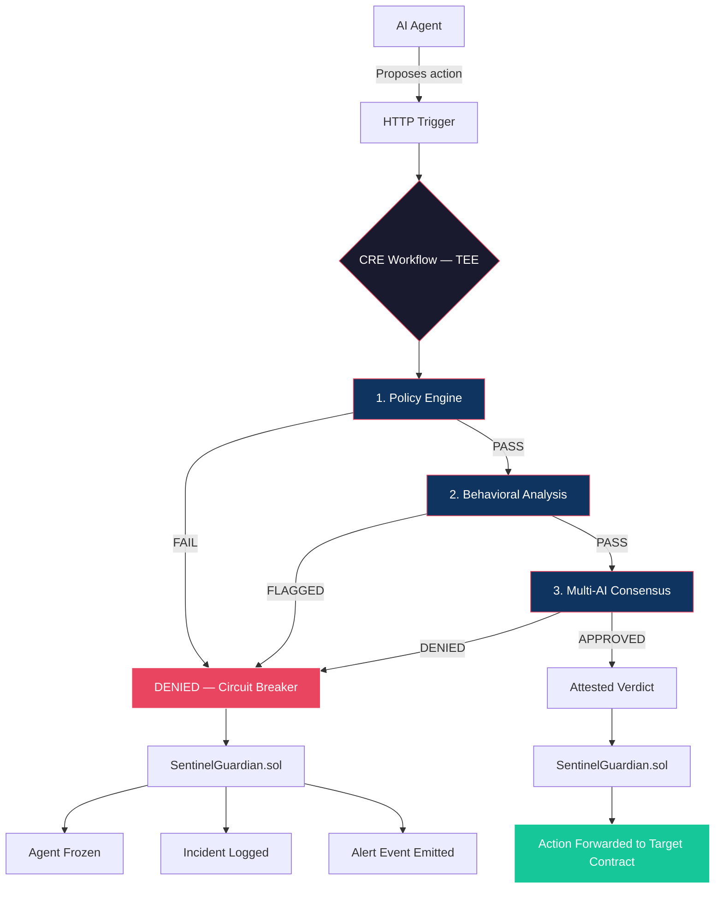
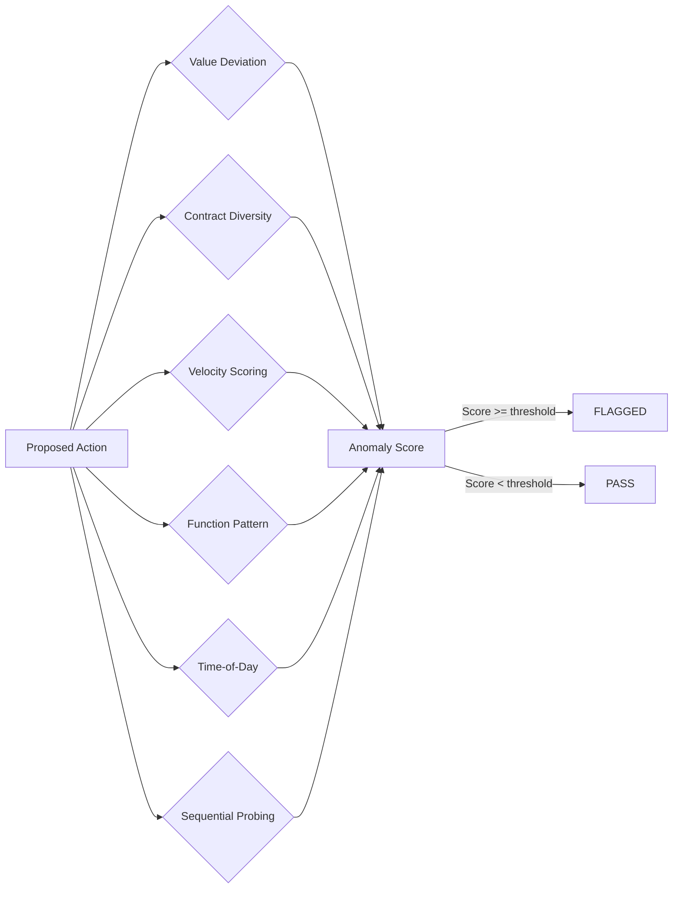
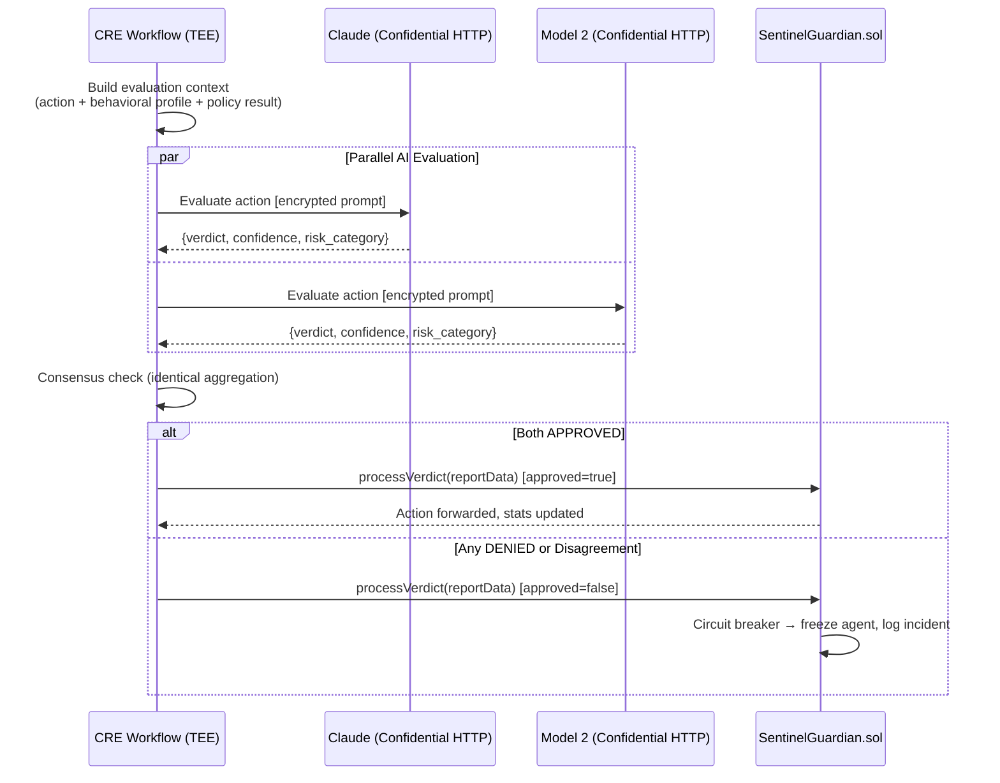
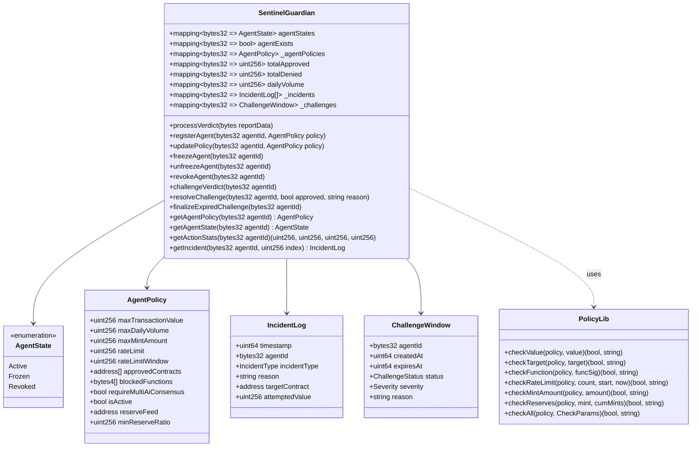
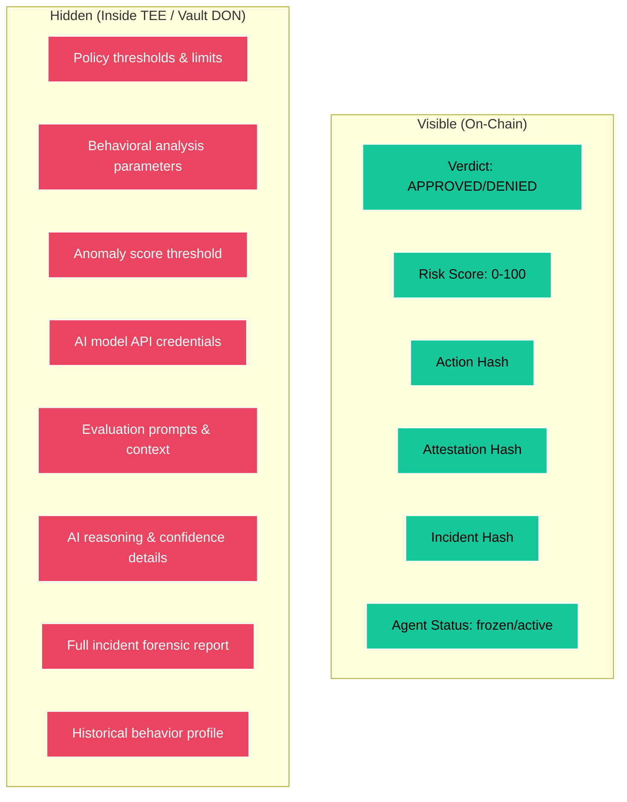
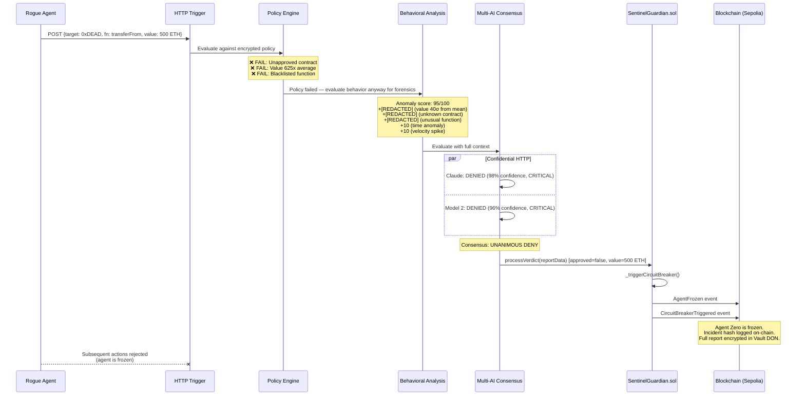

# SentinelCRE — Architecture

## System Overview

SentinelCRE is a decentralized AI guardrail protocol that sits between AI agents and on-chain execution. It evaluates every proposed action through three independent defense layers before allowing or blocking it.



## Defense Layers

### Layer 1: Policy Engine (Deterministic, Fast)

Hard-coded guardrails that are evaluated locally within the TEE. No network calls required. Sub-millisecond execution.

| Check | Description | Example |
|-------|-------------|---------|
| Value Limit | Max per-transaction value | 100 ETH |
| Approved Contracts | Whitelist of allowed targets | Uniswap Router, Aave Pool |
| Blacklisted Functions | Blocked function signatures | `selfdestruct`, `delegatecall` |
| Rate Limiting | Max actions per time window | 20 per hour |
| Cumulative Value | Max total value per window | 500 ETH per 24h |

**Confidential Compute**: All thresholds are stored encrypted in Vault DON. The agent cannot read its own limits.

### Layer 2: Behavioral Analysis (Statistical, Adaptive)

Pattern-based anomaly detection that catches attacks even when individual actions stay within policy limits.



| Dimension | What It Detects | Detection |
|-----------|----------------|-------------|
| Value Deviation | Transaction value > 2.5σ from historical mean | [REDACTED] |
| Contract Diversity | First interaction with unknown contract | [REDACTED] |
| Velocity | Action submitted in < 50% of expected interval | [REDACTED] |
| Function Pattern | Unusual function signature for this agent | [REDACTED] |
| Time-of-Day | Activity outside agent's normal hours | [REDACTED] |
| Sequential Probing | 3+ monotonically increasing values (binary search detection) | [REDACTED] |

**Key insight**: A threshold-only system can be binary-searched. Behavioral analysis detects the search pattern itself within 3-4 probes. The probing detection dimension (+[REDACTED]) is the highest-weighted signal because it directly counters the primary attack vector against invisible thresholds.

### Layer 3: Multi-AI Consensus (Independent, Redundant)

Two independent AI models evaluate the action with full context. Both must agree the action is safe.



**Confidential Compute**: API credentials AND evaluation prompts are hidden inside the TEE. Node operators cannot see which AI models are being called, what prompts are being used, or what context is being evaluated. Only the verdict exits.

**Consensus rule**: `consensusIdenticalAggregation` — all DON nodes must report the same verdict. If any node disagrees (due to non-deterministic AI output), consensus fails → DEFAULT DENY.

**Temperature**: All AI calls use `temperature: 0` for maximum determinism across nodes.

## Smart Contract Architecture



**Access control**: Three roles govern the contract — `DEFAULT_ADMIN_ROLE` (register/freeze/revoke agents, update policies), `WORKFLOW_ROLE` (process CRE verdicts, freeze agents, resolve challenges), and `CHALLENGER_ROLE` (appeal denied verdicts). Only the authorized CRE workflow can submit verdicts.

**Fail-safe principle**: The contract enforces that absence of verdict = denial by default. If the workflow is unavailable, no actions can be approved. All errors in `processVerdict()` trigger the circuit breaker rather than silently failing.

## Confidential Compute Integration Map



**The agent sees green. Everything red is invisible.** This is the fundamental innovation — security through confidential constraints, not security through obscurity.

## Data Flow: Rogue Agent Scenario



## Deployment Architecture

```
┌──────────────────────────────────────────────────┐
│                 CRE Platform                      │
│                                                   │
│  ┌────────────┐    ┌──────────────────────────┐  │
│  │ HTTP       │    │ Workflow DON              │  │
│  │ Trigger    │───▶│ (BFT Consensus)           │  │
│  │ Endpoint   │    │                           │  │
│  └────────────┘    │  ┌──────────────────────┐ │  │
│                    │  │ TEE (SGX/Nitro)      │ │  │
│                    │  │                      │ │  │
│  ┌────────────┐   │  │ Policy Engine        │ │  │
│  │ Vault DON  │◀──│──│ Behavioral Analysis  │ │  │
│  │ (Secrets)  │   │  │ AI Evaluation        │ │  │
│  └────────────┘   │  │                      │ │  │
│                    │  └──────────────────────┘ │  │
│                    └──────────────────────────┘  │
└────────────────────────┬─────────────────────────┘
                         │
                         ▼
            ┌────────────────────────┐
            │   Ethereum Sepolia     │
            │                        │
            │  SentinelGuardian.sol  │
            │  (Policy + Circuit     │
            │   Breaker + Registry)  │
            └────────────────────────┘
```

## Technology Stack

| Component | Technology | Why |
|-----------|-----------|-----|
| Orchestration | Chainlink CRE (TypeScript SDK) | Decentralized execution with BFT consensus |
| Privacy | Confidential HTTP + Vault DON | TEE-based confidential computation |
| Smart Contract | Solidity 0.8.24 (Foundry) | Policy enforcement + circuit breaker |
| AI Models | Claude + secondary model | Independent multi-model consensus |
| Chain | Ethereum Sepolia | Testnet for hackathon demo |
| Testing | CRE CLI simulation + Foundry | End-to-end workflow + contract testing |

## Ecosystem Positioning

SentinelCRE is infrastructure, not an application. It protects ANY AI agent on ANY protocol:

- **Coinbase x402**: AI agents paying for CRE workflow execution → SentinelCRE evaluates before execution
- **Aave Horizon**: Institutional DeFi agents → SentinelCRE ensures compliance and risk limits
- **Ondo Finance**: Tokenized fund management agents → SentinelCRE prevents unauthorized asset movement
- **Any AI-native protocol**: If it has an autonomous agent, it needs a guardrail layer
